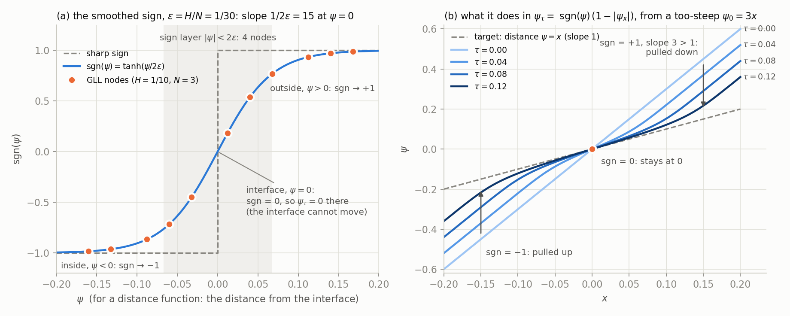

# Redistancing: what it is for, and how to use it here

A short reasoning document. `CDI_METHOD.md` §3–§4 defines the operations and
gives the equations in context; this one asks the narrower question of when to
run them. **§9 is different in kind:** it walks through what the Fortran
actually computes for Eq. (44), routine by routine, with the code, what was
checked, and where the discretisation is weak.

> **Building $\psi$ by Eq. (44) (`psi_init = "redistance"`) is the intended
> path**, for a reason that has nothing to do with accuracy: **the analytic signed
> distance is a crutch that does not exist for the problems this method is for.**
> Every result in this repo that seeds $\psi$ analytically is a result about a
> geometry we happened to know in closed form. `"exact"` is the validation
> baseline, not the destination. Whether periodic re-distancing ever beats
> transport is open (§8).

## 0. A word on the words

**Saini's usage is not this repo's, and the difference matters when reading their
paper against this code.** For them, Eq. (44) is *"the traditional level-set
(TLS) re-distancing equation"* — "re-distancing" names the **PDE**. The
**operation** is called **re-initialization** (Algorithm 1, line 19), and it is
always both halves together: line 20 reads *"Re-initialize $\phi^{n+1}$ using
Eq. (44), with the initial condition from $\psi^{n+1}$, Eq. (47)"* — reseed from
the phase field, **then** relax. Line 2 builds the field the same way.

**Their Algorithm 1 has no in-place mode.** The transported $\phi$ is *discarded*
at every reconstruction, so it only has to survive one $\Delta t_{tls}$ interval.
And the reseed is not incidental: they state its purpose three times as
*"ensuring congruence in the interface location, as given by the zero and 0.5
isocontour of the respective fields"* — it is **registration**, tying $\psi = 0$
back to $\phi = 0.5$.

This repo splits the two because its implementation can: `seed="phi"` is Saini's
operation as written, `seed="psi"` (relax in place, no reseed) is our own and has
no counterpart in their method. Below, "redistancing" means the relaxation alone
unless stated otherwise. See `CDI_METHOD.md` §4 for what each half costs.

## 1. What the normal actually requires

The compression term needs a direction, and only a direction:

$$
\mathbf{n} = \frac{\nabla\psi}{|\nabla\psi|}
$$

Take any strictly increasing $f$ and replace $\psi \to f(\psi)$. Then
$\nabla f(\psi) = f'(\psi)\,\nabla\psi$ with $f' > 0$, so

$$
\frac{\nabla f(\psi)}{|\nabla f(\psi)|}
= \frac{f'(\psi)\,\nabla\psi}{f'(\psi)\,|\nabla\psi|}
= \mathbf{n} .
$$

**The normal is invariant under any monotone reparametrisation of $\psi$.** It
depends on $\psi$'s *level sets*, not on $|\nabla\psi|$. So

> $|\nabla\psi| = 1$ is **not** a correctness requirement.

What we actually need is weaker, and worth stating separately:

1. the zero level set sits on the interface, and
2. $\nabla\psi \neq 0$ near it, so the division is well conditioned.

Redistancing enforces $|\nabla\psi| = 1$ everywhere. That is much stronger than
(1)–(2), and the extra strength is where the trouble comes from.

## 2. Why transport alone is enough in exact arithmetic

$\psi$ obeys pure advection,

$$
\frac{\partial \psi}{\partial t} + \mathbf{u}\cdot\nabla\psi = 0 ,
$$

whose level sets are material surfaces: each is carried by the flow. If
$\psi = 0$ starts on the interface, it stays on the interface, for all time,
**whatever $|\nabla\psi|$ does**. By §1 the normal is then exact too.

So redistancing is not a modelling correction. It is a purely numerical one,
and it must be justified numerically or not at all.

## 3. What actually goes wrong, and where

Differentiating the transport equation gives the evolution of the gradient
along a particle path,

$$
\frac{D|\nabla\psi|}{Dt} = -\,|\nabla\psi|\;\big(\mathbf{n}\cdot\nabla\mathbf{u}\cdot\mathbf{n}\big),
$$

so $|\nabla\psi|$ grows or decays exponentially with the **normal strain rate**.
Two consequences:

- **Rigid rotation and uniform advection preserve $|\nabla\psi|$ exactly.** For a
  rigid rotation $\nabla\mathbf{u}$ is antisymmetric, so
  $n_i n_j \partial_i u_j = 0$; for uniform advection $\nabla\mathbf{u} = 0$.
  Both give $D|\nabla\psi|/Dt = 0$.

  This is decisive for reading our results: **neither `advecting_slab_1d` nor
  `zalesak_disk` can test whether redistancing is needed.** They are isometries.
  Any drift they show is discretisation error, not the effect redistancing
  exists to counter.

- **Under real strain it drifts fast.** Evaluating
  $\mathbf{n}\cdot\nabla\mathbf{u}\cdot\mathbf{n}$ for `rider_kothe`'s velocity
  field gives normal strain rates up to $\pm2.5$, so $|\nabla\psi|$ changes by
  $e^{\pm 2.5} \approx 12$ per unit time at the worst points — and that case runs
  to $t=8$. Both directions hurt:
  $|\nabla\psi| \to 0$ leaves $\mathbf{n}$ normalising round-off, and
  $|\nabla\psi| \to \infty$ steepens $\psi$ past what the element can resolve,
  producing oscillations that corrupt the level sets near the interface.

Both are **conditioning** failures. Neither is repaired by insisting on
$|\nabla\psi| = 1$ specifically.

There is also a structural reason transport survives longer than the raw
$|\nabla\psi|$ statistics suggest: **$\psi$'s errors concentrate where they cannot
act.** The compression flux is $-\phi(1-\phi)\mathbf{n}$, which vanishes outside
the interface band, so $\psi$ only reaches $\phi$ within it. Measured on the 1D
run, $\max|\psi - \psi_{\text{exact}}|$ is 0.0010 inside the band against 0.0046
outside — the damage is 4.6× worse in the far field, which is precisely the
region that is dynamically irrelevant. This is also why the medial axis, which
lives far from the interface, is harmless to *transport* and yet central to
*redistancing* (§4a): transport never asks the far field to be accurate,
whereas the redistancing PDE drives the whole domain toward a target that has a
kink there.

## 4. What Saini et al. actually do — and why we cannot copy it

Their scheme (§3.1, Algorithm 1) is the same two equations we implemented, so
the difference is not in the PDE. It is in four things around it.

**(a) Their $\psi$ is banded from the start; ours is global.** Algorithm 1 line 2
*initialises* $\psi$ by solving the redistancing equation from the
$r_f(\phi-0.5)$ seed — **even where an analytic distance is available**. They are
explicit that an accurate global distance field is "unnecessary and not
attempted"; their Fig. 16b shows the recovered $\psi$ matching the exact distance
only inside the band. The validated runs seed from the exact global periodic
distance; `psi_init = "redistance"` does it Saini's way. Redistancing periodically
on top of an analytic $\psi$ is a different matter.

**Those two choices are incompatible, and that — not the PDE — is what our
recorded ablation actually measured.** Each event replaces a smooth global field with a
band-plus-remainder field, discontinuously. Upstream isolated this directly: a
single Algorithm-1-line-2 event on a $\phi$-seeded field works exactly as
advertised,

```
|grad psi| before: 2.09e-03   2.655   14.63     <- the raw r_f*(phi - 0.5) seed
|grad psi| after : 1.00e-01   1.023    2.553
```

so **the pseudo-time solve is sound at construction time**. What failed there,
and here, was repeating it against a global $\psi$. Any verdict of the form
"redistancing does not work" is therefore not supported; what is supported is
"redistancing does not work *on a globally-initialised $\psi$*".

**(b) Their normal is consumed far less often than ours.** Saini's scheme is
split: transport, then a *separate* re-sharpening equation (their Eq. 39) solved
in pseudo-time to a fixed point, and it is that relaxation which reads
$\mathbf{n}$. Neko's CDI is fused — the compression term lives inside the
transport equation and reads $\mathbf{n}$ **pointwise, every timestep**, 400 000
times over a Zalesak run. Noise in $\mathbf{n}$ that their periodic, smoothing
relaxation tolerates is injected straight into $\phi$ for us. This is the same
asymmetry that made the $\phi$-gradient normal fail here in the first place.

**(c) They stabilise $\phi$'s transport too.** Their Zalesak row is
$N_{svv} = N/2$, $c_0 = 1.0$ on the transport of *both* fields. Our $\phi$
equation carries no SVV, deliberately (`CDI_METHOD.md` §5). So they have a
smoothing mechanism on the field receiving the normal, and we do not.

**(d) Their cadence is a fixed timer, and so is ours; there is no $|\nabla\psi|$
trigger.** They use $\Delta t_{tls} \in [0.01, 0.5]$, roughly $10\times$ the CLS
interval; ours is `redistance.dt_tls`.

**The 1D case settles what such a criterion is worth.** There $|\nabla\psi|$ is
*provably* conserved (§3), so any drift is pure discretisation error — and in the
archived SVV-off run (not a configuration of this method) over
twenty flow-throughs it spans $\min = 0.0006$, $\max = 3.60$, a **5686×
spread**, while the mean never leaves $[0.93, 1.09]$. That run finishes at
$E_r = 0.00006$, the same as with SVV
(`examples/advecting_slab_1d/README.md`, `examples/advecting_slab_1d/evidence/slab_1d_grad_psi.png`).

So excursions of three orders of magnitude in $|\nabla\psi|$ are harmless,
exactly as §1 predicts, and a tolerance band around 1 measures nothing useful:
the *mean* is insensitive (it stayed inside $[0.8, 1.25]$ through a run in which
the field swung over four decades), and the *minimum* is over-sensitive (it
would have fired at almost every check, redistancing a solution that was already
correct). That is why the only cadence is the timer.

The only quantity with a claim to matter is **conditioning** — whether
$|\nabla\psi|$ has fallen far enough that $\nabla\psi/|\nabla\psi|$ normalises
round-off rather than a direction. That is an orders-of-magnitude question,
$10^{-12}$ rather than $0.8$, and $0.0006$ is nowhere near it.

What we did get right, worth recording: their coupled redistancing SVV is
$N_{svv} = N/4$, $c_0 = 2$ (their §4.5), much stronger than their transport
setting, because the fixed point has kinks at medial axes. Only their standalone
§4.4 test goes further, to $N/6$: "precluding spurious oscillations is not
feasible without" it (p. 19). We used $N/4$, $c_0=2$. And we avoided their
$\Delta\tau_{tls} = H/(N+1)$ formula, which is a pseudo-CFL of 2.75 on
`advecting_slab_1d`'s mesh ($H=1/10$, $N=10$; on Zalesak it is 0.905/1.419/1.949
at $N=3/5/7$). `CDI_METHOD.md` §4.2 shows that avoiding it was right, for a
reason that only shows up under *repeated* events.

## 5. What the Zalesak ablation measured

The recorded Zalesak redistancing runs ($\xi=2.8$, both seeds) were far worse than
transport alone, but they paired an analytic $\psi$ with banded periodic
redistancing (§4a), the $|\nabla\psi|$ trigger, the old `grad_floor` and the
event's history bug, so they say nothing about Algorithm 1 and are not citable.
The numbers, and the status of the shipped variants (now `psi_init = "redistance"`
on the timer, not yet re-run), are in
[`examples/zalesak_disk/README.md`](examples/zalesak_disk/README.md).

## 6. What we know, and what we do not

**Known.**

- The normal is invariant under monotone reparametrisation of $\psi$ (§1), so
  $|\nabla\psi| = 1$ was never the real requirement.
- Rigid rotation and uniform advection preserve $|\nabla\psi|$ **exactly** (§3).
  So neither `advecting_slab_1d` nor `zalesak_disk` can motivate redistancing,
  and neither can indict it: the effect it exists to counter is absent by
  construction.
- Transport plus SVV on $\psi$, from an exact global initial condition, carries
  Zalesak through ten rotations at $E_r = 0.022$ with zero boundedness
  violations. For that case, nothing further is needed.
- Periodic redistancing **on a globally-initialised $\psi$** was strongly harmful
  in the recorded runs, which are confounded (§5).
- The pseudo-time solve itself is sound when used as Saini use it — once, at
  construction, on a $\phi$-seeded field.

**The build works, once `unit_normal` is fixed.** The
coherent configuration (`psi_init = "redistance"` on Saini's own cadence and
pseudo-timestep) initially diverged at $N=5,7$ by $t\approx1.2$. The
cause was **a defect in this repo, not in the method**: `unit_normal` floored
$|\nabla\psi|$ at $10^{-30}$, below the $\sim10^{-19}$ round-off gradient of a
flat field, so where the banded $\psi$ is flat — 67.6% of the domain — the
normal was round-off normalised to a random unit vector. With
`grad_floor = 1e-6` the same runs are bounded to $10^{-11}$.
`CDI_METHOD.md` §4.1 has the mechanism and the evidence table.

Two things that follow:

- **§4(b) is a genuine asymmetry but not a barrier.** Saini's Eq. (38) transport
  carries no normal at all; $\mathbf{n}$ appears only in the Eq. (39)
  re-initialization, so a band-limited $\psi$ is exactly sufficient for them. A
  fused scheme reads $\mathbf{n}$ where a split scheme never does, and therefore
  has to handle $\nabla\psi = 0$ explicitly. That is one line of code, not a
  structural incompatibility.
- **The §5 ablation is confounded** on several counts at once (§5). It should
  not be cited for anything.

**Since measured (2026-09-08 to 2026-10-05).**

- **Rider–Kothe runs to completion with redistancing off**, the only case with real
  strain (re-run 2026-10-02 with the diffusion fix and SVV on $\psi$).
  - Band $|\nabla\psi|$ reaches a mean of 7.7 and a maximum of 15 at maximum stretch, and returns
    to 1.008 at $t=8$.
  - $\psi$'s normal stays within 0.6–1.3° of the exact interface throughout
    (`examples/rider_kothe/README.md`). So $\psi$ stays usable without any redistancing.
- **The coherent periodic phase, with the event's history restart (2026-10-02):**
  - **1D:** it costs nothing.
  - **Zalesak arm C:** $N=3$ and 7 still diverge, and $N=5$ completes 17× worse than without
    events. $\phi$'s contour fragments and every reseed sustains the fragments
    (`CDI_METHOD.md` §4.1c).
  - **Rider–Kothe, Saini's full configuration:** it completes, but its rebuilt $\psi$ points 4–8°
    off the exact interface, against 0.6–0.8° for the transported one (`CDI_METHOD.md` §4.1d).

**Still not known.**
- **Whether a monotone conditioning transform would serve better** (§8).

## 7. How to use it

**Settings that make a correct build**, measured on Zalesak at $\xi=1$,
$N\in\{3,5,7\}$ (`CDI_METHOD.md` §4.1–§4.2). They make the *build* right; periodic
events with them still fail on Zalesak (`CDI_METHOD.md` §4.1c) and do not beat
transport on Rider–Kothe (`CDI_METHOD.md` §4.1d).

| knob | value | why |
|---|---|---|
| `cdi.psi_init` | `"redistance"` | Algorithm 1 line 2. Builds $\psi$ from $\phi$ alone — **no analytic distance is evaluated at all**, which is the whole point |
| `cdi.grad_floor` | `1e-6` (default) | **required.** Below the round-off gradient of a flat field the normal is random noise; this was the bug |
| `redistance.band` | `2.5` | Saini's, and better than a global band on both $\phi_{\max}$ and mass drift |
| `redistance.cfl` | `0.1` (default) | **do not use `redistance.dtau = H/(N+1)`.** Saini's coarse pseudo-timestep is fine for a *one-shot* build but unstable under repeated events — see below |
| `redistance.dt_tls` | e.g. `0.5` | the only cadence is this timer; there is no $\lvert\nabla\psi\rvert$ trigger (§4d) |
| `redistance.seed` | `"phi"` | Eq. (47), reinit + relax — Algorithm 1 as written |

**On the pseudo-timestep:** the measurement on `advecting_slab_1d` is in
`CDI_METHOD.md` §4.2. Saini's $H/(N{+}1)$ looks *better* on a single build but
gives a wrong one ($|\nabla\psi|$ 0.067–3.165) that compounds under repeated
events; the fine step builds a field identical to the analytic distance, so the
closed form buys nothing there. **A one-shot test cannot detect this**, which is
why the cheap 1D case is worth keeping wired for redistancing.

**Do not** pair `psi_init = "exact"` with periodic redistancing. That is the
incoherent combination of §4(a): a global analytic field replaced discontinuously
by a banded one at every event. It is the configuration the recorded Zalesak
ablation ran, which is why its result (§5) is about the pairing and not about
redistancing.

## 8. What is still open

With redistancing off, $\psi$ stays usable through Rider–Kothe's maximum stretch (§6),
so no case in this repo needs redistancing after the build. What is not known:

- **Whether periodic reinitialization can beat transport anywhere here.**
  - On Zalesak the reseed sustains $\phi$'s contour fragments (`CDI_METHOD.md` §4.1c).
  - On Rider–Kothe, Saini's configuration completes but gives a worse normal (§4.1d). Its solve
    does not reach a distance in the compression band, and the thin tail has no $\phi$ contour to
    rebuild from.
  - The committed events path on Rider–Kothe (2026-10-06) converges $\psi$ onto $\phi$'s
    contour, which fragments from $t\approx2$: $E_r(8)$ 0.835 against transport's 0.0452
    (`CDI_METHOD.md` §4.1d).
  - The event-made $\psi$ fragments are made by `svv_step_imp`'s $|\mathbf c|=1$ step (§9.5). With the printed
    Eq. (31) form, BDF2/EXT2, and Saini's width 0.25 with $25H$, the reseed beats transport on
    $\phi$'s shape at $H=1/64$ and $1/128$ ($E_r(8)$ 0.0342 and 0.0085 against 0.0452 and 0.0104).
    Its $\psi$ is then not a distance in the band, and from $t\approx2$ its normal is further from
    the exact interface than transport's; $\phi$'s own normal is off by about as much, so the
    reseed imports $\phi$'s error. All on a
    scratch user file (`CDI_METHOD.md` §4.1d item 5).
- **Whether a monotone conditioning transform would serve better.** The normal is
  invariant under any monotone rescaling (§1), so
  $\psi \leftarrow L\tanh(\psi/L)$ flattens the far-field kinks without a pseudo-time
  solve and cannot move the interface. It never flattens the far field to round-off,
  so it never creates the region the `grad_floor` has to guard. Upstream measured the
  normal unchanged over 99.6% of the band; the exceptions are kinks *inside* the band.

## 9. How the code solves Eq. (44), step by step

This section explains what the Fortran actually computes. Everything runs through
routines that are **byte-identical in all four user files** (`rd_sgn`, `rd_rhs`,
`unit_normal`, and the SVV block with `svv_step_imp`) and through two pseudo-time
loops:

- `redistance` in the three coupled cases: SSP-RK3 on the §9.1 identity, then a
  Lie-split backward-Euler step of the shared `svv_step_imp`;
- `redistance_standalone` in `redistance_circles`: Saini's own BDF2/EXT2 (their
  Eqs. 34–35), with the dealiased Galerkin $\mathbf C(\mathbf w)\psi$, the Eq. (31)
  SVV unsplit in the implicit step (`svv_step_eq31`, built on the shared SVV
  routines, §9.5), then their sign guard. This is the authors' configuration
  (`examples/redistance_circles/README.md` §2).

The code excerpts are from `redistance_circles.f90`; the shared routines are the
same code in every file. "Redistancing" means the relaxation by Eq. (44) alone,
as in §0.

### 9.0 Two clocks: what Neko solves, and what our own loop solves

**Short answer: Neko's scalar framework never solves the redistancing equation,
Eq. (44). Our own pseudo-time loop in the user file does.** Neko's scalar
framework is used only for the *physical* transport of $\psi$ by the flow,
Eq. (43), and only in the coupled cases.

There are two separate clocks:

| | physical time $t$ | pseudo time $\tau$ |
|---|---|---|
| equation | Eq. (43): $\partial_t\psi+\mathbf u\cdot\nabla\psi=S_{vv}(\psi)$, $\psi$ carried by the flow | Eq. (44): $\psi$ relaxed toward $\lvert\nabla\psi\rvert=1$, interface held fixed |
| solved by | **Neko's scalar framework** (`scalar_pnpn`) for the advection; the SVV is ours (a user source term, or an implicit sub-step in the `compute` hook) | **our own loop**: `redistance` (coupled cases) or `redistance_standalone` (`redistance_circles`) |
| time scheme | BDF$k$/EXT$k$, $k$ = `numerics.time_order`; advection explicit and extrapolated, dealiased if `numerics.dealias` | coupled cases: **SSP-RK3** (explicit) for $\operatorname{sgn}(\psi)(1-\lvert\nabla\psi\rvert)$, then **one backward-Euler SVV step** (our own CG). `redistance_circles`: **BDF2/EXT2** as Saini print it, the explicit terms (with the dealiased $\mathbf C(\mathbf w)\psi$) extrapolated, the Eq. (31) SVV implicit (our own CG), then the sign guard |
| step size | `case.time.timestep` | fixed `rd_dtau`: `case.cdi.redistance.dtau` if set (5e-4 in `redistance_circles`, Saini's value), otherwise pseudo-CFL `cfl` × $h_{\text{GLL,min}}$ |
| how long | to `end_time` | a fixed number of steps; there is no convergence test (`CDI_METHOD.md` §4.3) |

**Where each runs.** The order comes from Neko's `src/simulation.f90`, which calls
`user%initialize` once before the time loop (line 91) and `user%compute` after
each physical step (line 179). In a coupled case (`zalesak_disk`, `rider_kothe`,
`advecting_slab_1d`):

```
user%initialize   -> redistance(..., "psi_init build")      ! tau loop: 0 -> band*H   (psi_init = "redistance")
do physical steps:
   fluid step        (frozen; the user file prescribes the velocity, every step in rider_kothe)
   scalars%step      -> NEKO solves phi and psi transport, BDF/EXT in t
   user%compute      -> implicit SVV sub-step on psi (ours), and
                        if an event is due: redistance(...) ! tau loop: 0 -> band*H
                        (the order of these two differs between the case files)
   output
end do
```

In `redistance_circles`:

```
user%initialize   -> redistance_standalone                   ! tau loop: 0 -> 6, 12000 pseudo steps
output            -> the single frame: the relaxed field
one formal physical step (fluid frozen at u = 0, psi's diffusivity 1e-16); every reported number is already taken
```

In `redistance_circles` the `.case`'s scalar `psi` is only a container. Neko's
scalar framework allocates and outputs it, but never evolves it in any way that
matters.

**One pseudo step, in words: the coupled cases.**

1. Evaluate $\operatorname{sgn}(\psi)(1-|\nabla\psi|)$ from the current $\psi$
   (`rd_rhs`, §9.3), and take an explicit step. Do that three times, in the
   SSP-RK3 combination (§9.4).
2. Smooth once with the SVV by solving $(\mathbf B+\Delta\tau\,\mathbf S)\,\psi^{\text{new}}=\mathbf B\,\psi$
   with our own CG (§9.5).

That is a first-order Lie split: explicit transport, then implicit smoothing.

**One pseudo step, in words: `redistance_circles`** (Saini's Eqs. 34–35).

1. From $\psi^n$ alone, form $\mathbf w^n=\operatorname{sgn}(\psi^n)\mathbf n(\psi^n)$ and
   $F^n=\operatorname{sgn}(\psi^n)-\mathbf C(\mathbf w^n)\psi^n$, with $\mathbf C$ dealiased.
2. Extrapolate with the lagged $F^{n-1}$, which was built the same way from $\psi^{n-1}$,
   and add the BDF history: this gives $\hat\psi$.
3. Solve $(\mathbf B+\tfrac{\Delta\tau}{b_0}\mathbf D_\mu(\psi^n)\mathbf S)\,\psi^{n+1}=\mathbf B\hat\psi$.
4. The guard: a node whose $\psi^n$ disagrees in sign with $\psi_0$ keeps $\psi^n$.
Neko supplies only building blocks: the element derivative `grad`, the
gather–scatter `gs_h%op`, field arithmetic, and `tnsr3d` for the SVV operator.
It supplies no time integrator and no solver for this equation.

**Why not use Neko's scalar framework for Eq. (44)?** Its scalar equation is
$\rho c_p(\partial_t s+\mathbf u\cdot\nabla s)=\nabla\cdot(\lambda\nabla s)+f$,
and $\mathbf u$ is always the *fluid's* velocity: the registry fields `u`,
`v`, `w` (`src/scalar/scalar_scheme.f90:353`), passed to `adv%compute_scalar`.
The scalar key `"advection": false` switches the term off. There is no
per-scalar velocity, and it runs on the physical clock. Routing Eq. (44) through
it would mean one of two things:

- overwriting a frozen fluid's velocity with $\mathbf w$ at every step and
  marching "physical" time as pseudo time; or
- switching advection off and supplying
  $\operatorname{sgn}(\psi)-\mathbf w\cdot\nabla\psi$ as a user source term,
  which is the §9.1 shortcut, evaluated as a source and extrapolated by EXT.

The first is the "native" route. The second is our scheme with a different time integrator. In
both cases the coupled runs would lose the ability to run a redistancing event
*between* two physical steps.

**Against Saini's Algorithm 1.** Their naming is transposed: their TLS field
$\phi$ is our $\psi$. Side by side, from their §2.5, §3.4, §4.4 and Algorithm 1:

| | Saini et al. (Nek5000) | this repo |
|---|---|---|
| integrator for Eq. (44) | BDF2/EXT2. §2.5: *"the same time discretization scheme is used for all governing equations"*. The SVV is implicit inside $\mathbf H=\tfrac{b_0}{\Delta t}\mathbf M+\mathbf D_\mu\mathbf S_{vv}$ (Eqs. 34–35); the convective term and $\operatorname{sgn}$ are explicit, extrapolated from the two previous levels | `redistance_circles`: the same, BDF2/EXT2 with $\mathbf D_\mu$ from $\psi^n$. Coupled cases: SSP-RK3, explicit, for $\operatorname{sgn}(\psi)(1-\lvert\nabla\psi\rvert)$, then one backward-Euler SVV step (Lie split) |
| does the difference matter? | | **No.** Their BDF2/EXT2, and BDF3/EXT3, run in Neko within 1.9% of SSP-RK3 in every holding Table 2 cell to $\tau=24$ ($H{=}1/10$, $N{=}7$ to $\tau=15$, before it blows up), from both ICs (`examples/redistance_circles/archive/README_process_2026-09.md` §7.4) |
| convective term | $\mathbf C(\mathbf w)u$ in Eq. (7), with $\mathbf n$ from Eq. (42), Galerkin with GLL quadrature (p. 4). The paper states neither how $\nabla\phi$ is formed nor any dealiasing; their code averages the gradient and dealiases (`convect_new`) | `redistance_circles`: the same, dealiased (`adv_dealias_t`) with the averaged gradient. Coupled cases: the non-dealiased §9.1 identity, which equals the GLL Galerkin form to 1e-14 |
| sign guard | not in the paper; their code (`constrainTLSR`) keeps $\phi^n$ where it disagrees in sign with the phase field | `redistance_circles`: the same, against the sign of $\psi_0$. Coupled cases: none |
| $\Delta\tau$, §4.4 | $5\times10^{-4}$, fixed, to $\tau=6$ ("CFL = 0.28" at the finest mesh) | the same (`case.cdi.redistance.dtau`) |
| $\Delta\tau$ in the coupled algorithm | automated (§3.4): $\Delta\tau_{tls}=H/(N{+}1)$, taking $\lvert\mathbf w\rvert\le1$, and $N_{tls}=2.5H/\Delta\tau_{tls}=2.5(N{+}1)$ steps | pseudo-CFL 0.1 on $h_{\text{GLL,min}}$ by default, same band $2.5H$. $H/(N{+}1)$ is a pseudo-CFL of 0.9 at $N=3$ and 2.75 at $N=10$, and was measured unstable under repeated events (`CDI_METHOD.md` §4.2) |
| where the $\tau$ loop runs | line 2: initial build from Eq. (47); lines 19–21: every $\Delta t_{tls}$, **after** the Navier–Stokes solve, always reseeded by Eq. (47) | `initialize` hook: the build (`psi_init="redistance"`); `compute` hook: events after Neko's fluid and scalar steps; `seed="phi"` is Eq. (47), `seed="psi"` is our own in-place variant (§0) |
| convergence test on the $\tau$ loop | none; a fixed $N_{tls}$ | none; a fixed `rd_niter` (`CDI_METHOD.md` §4.3) |

Two things in their text are not stated and would matter here. One is how
$\nabla\phi$ in Eq. (42) is formed (§9.9). The other is how a pseudo-CFL of
0.9–2.75 is stable under EXT2, whose explicit limit for advection is well below
that. Nek5000 offers characteristic (OIFS) subcycling of the convective term,
which would explain it, but the paper does not mention it.

### 9.1 The equation, and the one shortcut we take

Saini's Eqs. (44)–(46):

$$\frac{\partial\psi}{\partial\tau} + \mathbf{w}\cdot\nabla\psi = \operatorname{sgn}(\psi) + S_{vv}(\psi),
\qquad \mathbf{w} = \operatorname{sgn}(\psi)\,\mathbf{n},
\qquad \mathbf{n} = \frac{\nabla\psi}{|\nabla\psi|},
\qquad \operatorname{sgn}(\psi) = \tanh\!\Big(\frac{\psi}{2\varepsilon}\Big).$$

**In words:** information moves along the normal, *away* from the interface, at
speed $|\operatorname{sgn}\psi|\le1$. As it travels, the source adds 1 per unit
of distance, so behind the front $\psi$ grows at exactly slope 1: $|\nabla\psi|\to1$.
On the interface itself $\operatorname{sgn}(0)=0$, so nothing there moves. The
interface is what every other value is measured *from*.

**The shortcut.** $\mathbf n$ is $\nabla\psi$ divided by its own length, so

$$\mathbf{w}\cdot\nabla\psi = \operatorname{sgn}(\psi)\,\frac{\nabla\psi\cdot\nabla\psi}{|\nabla\psi|} = \operatorname{sgn}(\psi)\,|\nabla\psi| ,$$

and the whole right-hand side collapses to

$$\frac{\partial\psi}{\partial\tau} = \operatorname{sgn}(\psi)\,\big(1-|\nabla\psi|\big) + S_{vv}(\psi).$$

**When is the last equality true?** For any vector $\mathbf g\neq\mathbf 0$,
$\mathbf g\cdot\mathbf g/|\mathbf g|=|\mathbf g|^2/|\mathbf g|=|\mathbf g|$
exactly, so it holds wherever $\nabla\psi\neq0$. There are two caveats.

- **At $\nabla\psi=0$ the left side is undefined** ($\mathbf n=\mathbf 0/0$). The
  right side gives 0, which is its limit. Explicit code has to pick something
  instead: `unit_normal` divides by $\max(|\mathbf g|,10^{-6})$, which gives
  $|\mathbf g|^2/10^{-6}\approx0$. The two agree to within $10^{-6}$.
- **It needs the same $\nabla\psi$ in $\mathbf n$ and in the dot product.** In
  the continuum there is only one, but discretely this is a real condition. Take
  $\mathbf n$ from one gradient $\mathbf g$ and dot it with another,
  $\mathbf g'$: element-local, or evaluated on a dealiasing grid. Then, by
  Cauchy–Schwarz, $\mathbf n\cdot\mathbf g'\le|\mathbf g'|$, with equality only
  when the two are parallel. `rd_rhs` uses one averaged nodal gradient
  throughout, so for our code the equality is exact (checked to 1e-15, §9.8).
  The dealiased form breaks it, and that is part of why it behaves differently.
  At kinks $|\nabla\psi|$ is not defined at all, and which discrete value gets
  used is §9.9.

**We never build $\mathbf w$, but the transport has not gone anywhere: it is
inside $|\nabla\psi|$.** In 1D, where $\psi>0$ and $\psi_x>0$, the shortcut reads
$\psi_\tau = 1-|\psi_x|$, i.e. $\psi_\tau+\psi_x=1$. That is literally the
advection equation at speed $+1$ with a source. In 2D the shortcut is a
Hamilton–Jacobi equation, and its characteristics, the paths along which
information travels, have velocity
$\partial_{\mathbf p}\big(\operatorname{sgn}(\psi)|\mathbf p|\big)=\operatorname{sgn}(\psi)\,\mathbf p/|\mathbf p|=\mathbf w$,
the same $\mathbf w$ as Eq. (45). Linearised, it is
$-\mathbf w\cdot\nabla\delta+\operatorname{sgn}'(\psi)(1-|\nabla\psi|)\,\delta$,
advection by $\mathbf w$ plus a zeroth-order term (checked discretely, §9.8).

What the shortcut changes is only *how the term is written*: no division by
$|\nabla\psi|$, and no separate convective operator. §9.8 shows that, on this
mesh, it gives exactly the same numbers as the non-dealiased Galerkin convective
operator $\mathbf C(\mathbf w)\psi$ would.

A useful way to read the bracket is as a thermostat on the slope:

- where the slope is too shallow ($|\nabla\psi|<1$), $\psi$ is pushed away
  from zero;
- where it is too steep, $\psi$ is pulled back toward zero;
- at slope 1, nothing happens.

The $\operatorname{sgn}$ in front makes the push point the right way on each
side of the interface. Because the slope is a derivative, each push depends on
the neighbouring values, and that dependence is what carries the information
outward at speed $|\mathbf w|$.

Where this equation is solved, and by which code, is §9.0.

### 9.2 `rd_sgn` — the smoothed sign, Eq. (46)

```fortran
do i = 1, n
  sgnfld%x(i,1,1,1) = tanh(psifld%x(i,1,1,1)/(2.0_rp*eps))
end do
```

This is a pointwise function of the current $\psi$, and has no GPU kernel, so it
round-trips through the host (as does `redistance_circles`' sign guard). The width
$\varepsilon$ differs by case:

- in the coupled cases it is the CDI interface width;
- in `redistance_circles` it is `case.cdi.epsilon`, set to 0.25, the fixed value in
  Saini's code (`signls`; not in the paper). There is no phase field there.



**(a) What it is.** $\operatorname{sgn}(\psi)$ tells each point which side of
the interface it is on: $+1$ outside, $-1$ inside, and **exactly 0 on the
interface**. $\varepsilon$ only sets how sharply it switches. At a phase-field-like
$\varepsilon=H/N$ the layer $|\psi|<2\varepsilon$, which carries the rise from
$-0.76$ to $+0.76$, holds only about four GLL nodes at $H{=}1/10$, $N{=}3$, so the
switch is barely resolved. At `redistance_circles`' 0.25 the layer is $|\psi|<0.5$,
several elements wide on every mesh.

**(b) What it does.** Start from a profile that is too steep, $\psi_0=3x$. On
each side $\operatorname{sgn}$ picks the direction of the push, so both halves
are pulled toward slope 1, while the point $\psi=0$ does not move. The
corrected region spreads outward from the interface at speed
$|\operatorname{sgn}\psi|\approx1$, which is the transport hidden inside
$|\nabla\psi|$ (§9.1). Close to the interface, where $|\operatorname{sgn}|<1$,
it spreads more slowly.

Panel (b) is a fine-grid first-order upwind solve of the 1D equation, drawn
only to show what the equation does; it is not our scheme. The script is
`figures/redistancing_sgn.py`.

The same $|\operatorname{sgn}(\psi)|$ is also the characteristic speed
$|\mathbf w|$, and so the weight $\mathbf D_\mu$ in Saini's Eq. (31). That is
why the printed SVV vanishes on the interface (§9.5).

### 9.3 `rd_rhs` — the right-hand side, $\operatorname{sgn}(\psi)(1-|\nabla\psi|)$

Trimmed; the host build calls `grad` on `%x` instead of `%x_d`:

```fortran
call grad(g1%x_d, g2%x_d, g3%x_d, psifld%x_d, coef)     ! (1) per element
call coef%gs_h%op(g1, GS_OP_ADD)                         ! (2) add the elements'
call coef%gs_h%op(g2, GS_OP_ADD)                         !     values at shared
call coef%gs_h%op(g3, GS_OP_ADD)                         !     nodes ...
call col2_raw(g1, coef%mult, coef%mult_d, n)             !     ... and divide by
call col2_raw(g2, coef%mult, coef%mult_d, n)             !     how many there are
call col2_raw(g3, coef%mult, coef%mult_d, n)
call field_col3(w, g1, g1, n)                            ! (3) |g| = sqrt(g.g)
call field_addcol3(w, g2, g2, n)
call field_addcol3(w, g3, g3, n)
call field_sqrt(w, n)
call rd_sgn(psifld, lval, n)                             ! (4) sgn(psi)
call field_cmult(w, -1.0_rp, n)
call field_cadd(w, 1.0_rp, n)                            !     1 - |g|
call field_col2(lval, w, n)                              !     sgn*(1 - |g|)
```

1. **`grad`** differentiates each element's own polynomial. $\psi$ is continuous
   across element faces but its slope is not, so at a node on a face the two
   (or four) elements that share it generally report different gradients.
2. **`gs_h%op(ADD)` then `col2 mult`** add those values and divide by the node's
   multiplicity. In Neko, `coef%mult` holds $1/\text{multiplicity}$
   (`src/sem/coef.f90:417`). The result is one continuous, averaged gradient per
   node.
3. **The length** of that averaged gradient.
4. **The product.**

**Remember the order: average the gradient first, then take its length.**
§9.9 is about exactly this.

### 9.4 The pseudo-time loops — BDF2/EXT2 in `redistance_circles`, SSP-RK3 in the coupled cases

**`redistance_circles`: Saini's BDF2/EXT2** (`redistance_standalone`, trimmed):

```fortran
sgn0 = sign(1, psi_0)                                           ! the guard's reference
do it = 1, rd_niter
  ! b0, beta, a = 1, (1,0), (1,0) on step 1; 3/2, (2,-1/2), (2,-1) after
  call unit_normal(coef, psifld, nx, ny, nz, w)                 ! n^n, averaged gradient
  call rd_sgn(psifld, sg, n)                                    ! sgn(psi^n)
  call field_col2(nx, sg, n)                                    ! w^n = sgn n  (and ny, nz)
  call field_rzero(cw, n)
  call adv_d%compute_scalar(nx, ny, nz, psifld, cw, coef%Xh, coef, n)  ! -(B C(w^n) psi^n)_e: weak form per element, dealiased
  call field_cmult(cw, -1.0_rp, n)
  call coef%gs_h%op(cw, GS_OP_ADD)                              ! gather-scatter,
  call col2_raw(cw, coef%Binv, coef%Binv_d, n)                  !   then B^-1
  call field_sub3(f0, sg, cw, n)                                ! F^n = sgn - C(w^n) psi^n
  call field_copy(ref, psifld, n)                               ! psi^n, for D_mu, the lag, the guard
  call field_cmult(psifld, beta(1), n)                          ! psi_hat = (beta1 psi^n
  if (it > 1) call field_add2s2(psifld, p1, beta(2), n)         !   + beta2 psi^{n-1}
  call field_add2s2(psifld, f0, rd_dtau*a(1), n)                !   + dtau a1 F^n
  if (it > 1) call field_add2s2(psifld, f1, rd_dtau*a(2), n)    !   + dtau a2 F^{n-1})
  call field_cmult(psifld, 1.0_rp/b0, n)                        !   / b0
  call svv_step_eq31(coef, psifld, ref, rd_dtau/b0, cg_iters)   ! (B + dtau/b0 D_mu S) psi^{n+1} = B psi_hat
  where (sign(1, ref) * sgn0 < 0) psifld = ref                  ! the guard (a host loop in the file)
  call field_copy(p1, ref, n)
  call field_copy(f1, f0, n)
end do
```

- **$\mathbf w$ is formed from the level it multiplies.** The lag holds the product
  $F^{n-1}$, never $\mathbf w^{n-1}$.
  - $\mathbf w$'s own $\operatorname{sgn}'(\psi)|\nabla\psi|\,\delta$ cancels the
    source's $\operatorname{sgn}'(\psi)\,\delta$ on the zero set. A frozen, lagged or
    extrapolated $\mathbf w$ leaves growth at up to $1/2\varepsilon$ there (§9.8).
- **$\mathbf C$ is dealiased**, on $\lfloor3(N+1)/2\rfloor$ Gauss points per
  direction (Neko's `adv_dealias_t`), as in Saini's code. It evaluates $\mathbf w$
  between nodes, so a node on the zero set can move and change sign. The
  non-dealiased GLL form, which the coupled cases keep, sees only $\mathbf w_i$ at
  node $i$ and leaves such a node alone.
- **The guard** then keeps $\psi^n$ at any node whose $\psi^n$ has the opposite sign
  to $\psi_0$. On the zero set that sign is round-off, so low-$N$ results depend on it
  (`examples/redistance_circles/README.md` §5).
- **Validation.** It gives the authors' `plot.py` values, and exactly so when started
  from their zero-set $\psi_0$ (`examples/redistance_circles/README.md` §4–§5).
- **How many steps.** `rd_niter = tau_end/dtau`: 12000 for $\tau=6$, with no
  convergence test.

**The coupled cases: SSP-RK3, then one implicit SVV step** (`redistance`,
trimmed of its re-seed and reporting):

```fortran
do it = 1, rd_niter
  call field_copy(d0, psifld, n)
  call rd_rhs(coef, psifld, lval, g1, g2, g3, w)
  call field_add2s2(psifld, lval, rd_dtau, n)                  ! u1 = u0 + dt L(u0)
  call rd_rhs(coef, psifld, lval, g1, g2, g3, w)
  call field_add2s2(psifld, lval, rd_dtau, n)
  call field_cmult(psifld, 0.25_rp, n)
  call field_add2s2(psifld, d0, 0.75_rp, n)                    ! u2 = 3/4 u0 + 1/4 (u1 + dt L(u1))
  call rd_rhs(coef, psifld, lval, g1, g2, g3, w)
  call field_add2s2(psifld, lval, rd_dtau, n)
  call field_cmult(psifld, 2.0_rp/3.0_rp, n)
  call field_add2s2(psifld, d0, 1.0_rp/3.0_rp, n)              ! u  = 1/3 u0 + 2/3 (u2 + dt L(u2))
  if (svv_rd%on) call svv_rd%step_imp(coef, psifld, rd_dtau, cg_iters)
end do
```

- **Three stages, each from the latest $\psi$.** Both $\operatorname{sgn}$ and
  $|\nabla\psi|$ (and so, implicitly, $\mathbf w$) are recomputed at every
  stage. $\mathbf w$ is never frozen or lagged: it is "live".
- **Why RK3 and not Euler.** Linearised, Eq. (44) is advection. The
  collocation derivative has an imaginary spectrum, which forward Euler
  amplifies at every wavenumber, while SSP-RK3 covers the imaginary axis.
- **Then one backward-Euler SVV step.** SVV is applied separately, after the
  RK step. That is a first-order Lie split. On `redistance_circles` this scheme
  gave the same results as BDF2/EXT2 to within 2.2% at §4.4's $N_{svv}=N/6$. At
  $N/4$, $H{=}1/5$, $N{=}7$ its split damping held the apex where BDF2 fails
  (`examples/redistance_circles/archive/README_process_2026-09.md` §7.5).
- **How many steps.** `rd_niter = band*H/dtau` (`zalesak_disk.f90`). Information
  travels at speed $\le1$, so after $\tau=\text{band}\cdot H$ the field has been
  rebuilt out to that distance from the interface. **The band is a pseudo-time
  budget, not a spatial mask.**

### 9.5 The SVV step — `svv_local`, `svv_step_imp` and `svv_step_eq31`

The shared operator is

$$\mathbf S = \tilde D^T\,\nu\,G\,\tilde D,\qquad \tilde D = F D,$$

- $D$ is the derivative.
- $F=V\operatorname{diag}\big((k/N)^{N_{svv}}\big)V^{-1}$ is a modal filter
  (Saini Eq. 24, and Eq. 27's $\hat B\hat Q\hat B^{-1}$). It passes nothing of the
  element mean ($k=0$) and all of the highest mode ($k=N$).
- $\tilde D$ appears on both sides, so the kernel enters once per side, exactly as
  in Saini's Eq. (28).
- So $\mathbf S$ is a Laplacian that sees **only the wiggliest polynomial modes
  in each element**. That is where it removes noise, and it leaves the
  smooth part alone. It is exactly zero on a linear function, which is why,
  without dealiasing, a flat interface is an exact discrete steady state
  (`examples/redistance_circles/archive/README_process_2026-09.md` §8.3).

`svv_local` builds it in exactly this order: derivative (`dx`), then filter
(`fh`), then $G$ and $\nu$, then the two transposes.

$\nu=c_0|\mathbf c|H/N$ is constant in `svv_local`, with $|\mathbf c|$ the
module's `u_max`: 1 in `redistance_circles`, the flow speed for transport, and,
in the coupled files, the flow speed for redistancing too. It sits *inside* the
bilinear form
(`call field_col2(this%w2, this%nu, n)`, between $\tilde D$ and $\tilde D^T$).
Two implicit steps are built on it, each solved by CG to $10^{-12}$ relative:

- **`svv_step_imp`** (shared; the coupled cases):
  $(\mathbf B + \Delta\tau\,\mathbf S)\,\psi^{\text{new}} = \mathbf B\,\psi^{\text{old}}$,
  mass-preconditioned. It conserves mass exactly. For Eq. (44) it acts on the
  zero set and drags the interface.
- **`svv_step_eq31`** (`redistance_circles` only): Saini's Eqs. (7), (31), (33)
  as printed.
  - A diagonal $\mathbf D_\mu=\operatorname{diag}|\operatorname{sgn}\psi^n|$, taken from
    the start-of-step level passed in as `sref`, *left-multiplies* the assembled
    operator:
    $(\mathbf B + \tfrac{\Delta\tau}{b_0}\,\mathbf D_\mu\mathbf S)\,\psi^{n+1} = \mathbf B\,\hat\psi$.
  - It is exactly zero on the interface.
  - The operator is not symmetric. So it is solved for $z$ with
    $\psi^{n+1}=\hat\psi+\mathbf D_\mu z$:
    $(\mathbf D_\mu\mathbf B+\tfrac{\Delta\tau}{b_0}\,\mathbf D_\mu\mathbf S\mathbf D_\mu)\,z=-\tfrac{\Delta\tau}{b_0}\,\mathbf D_\mu\mathbf S\,\hat\psi$,
    which is symmetric, and consistent where $\mathbf D_\mu=0$. The preconditioner
    $1/(\mathbf D_\mu\mathbf B)$ is zeroed there.
  - It does not conserve mass; a distance does not need to.

### 9.6 `unit_normal` and `grad_floor` — the coupled cases' compression term

```fortran
! (same grad + gs ADD + mult averaging as rd_rhs, then:)
call field_sqrt(w, n)                        ! w = |g|
call field_cpwmax2(w, grad_floor, n)         ! w = max(|g|, grad_floor)
call field_invcol2(g1, w, n)                 ! n = g / w
```

This builds the $\mathbf n$ that the CDI compression term reads. It uses the same
averaged gradient as `rd_rhs`. The floor stops a flat $\psi$, whose gradient is
round-off (~1e-19), from being turned into a random unit vector. It must stay
well above round-off: the default 1e-6 is load-bearing (`CDI_METHOD.md` §4.1).
The redistancing loop itself never divides by $|\nabla\psi|$, which is one
thing the §9.1 shortcut buys.

### 9.7 The re-seed — coupled cases only

```fortran
if (use_seed .eq. RD_SEED_PHI) then          ! Saini Eq. (47): psi = r_f (phi - 0.5)
  call field_copy(psifld, s, n)
  call field_cadd(psifld, -0.5_rp, n)
  call field_cmult(psifld, rd_rf, n)
end if
```

- `seed="phi"` discards the transported $\psi$ and restarts from the phase
  field. That is reinitialization in Saini's sense (§0).
- `seed="psi"` skips this block and relaxes the transported $\psi$ in place.
- `redistance_circles` has no phase field. It starts from Eq. (83)'s skewed
  $\psi_0$.

### 9.8 What was checked, step by step (2026-09-23)

These checks predate the shipped `redistance_circles` configuration (they used the
sign-function $\varepsilon=H/N$, the non-dealiased $\mathbf C$ and no guard). What they verify
about the shared routines still holds for the coupled cases.

**These checks were redone on 2026-09-28 without the replica, against the rendered paper,
first principles and Neko's own routines. No implementation error was found**
(`examples/redistance_circles/archive/README_process_2026-09.md` §6.1). A rebuild from the paper alone, with
Neko's own operators, then reproduced the committed runs (same README, §6.2).
The audit found two things the table
below does not show:
- $\mathbf D_\mu(\psi^n)$ makes the step first order in $\Delta\tau$, though $E_r(6)$ moves at
  most 0.31% when it is extrapolated;
- Neko's own `time_order` 2 extrapolates with a modified EXT3, not EXT2.

Each item was checked in the numpy replica of `redistance_circles`, which
reproduced the Fortran node by node to $1.3\times10^{-13}$ (RK3; BDF2 to $3.9\times10^{-13}$) from the same
$\psi_0$ (`examples/redistance_circles/archive/README_process_2026-09.md` §6), at $H{=}1/10$, $N{=}3$:

| step | check | result |
|---|---|---|
| Eq. (83), $\varepsilon$ | hand-derived spot values; $\varepsilon=H/N$ | exact; $\int\psi_e=3.419119$ |
| averaged gradient (§9.3) | polynomial of degree $\le N$ / smooth field | 5e-13 / 1e-5 |
| the shortcut (§9.1) | $\operatorname{sgn}(1-\lvert g\rvert)$ against $\operatorname{sgn}-\mathbf w\cdot g$ built explicitly | 1e-15 |
| the shortcut *is* the Galerkin operator | against the weak form $\mathbf B^{-1}\mathbf C(\mathbf w)\psi$ with GLL quadrature and a continuous $\mathbf w$ | 1e-14 |
| $\mathbf w$ depending on $\psi$ | finite-difference Jacobian against $-\mathbf w\cdot G\delta+\operatorname{sgn}'(1-\lvert g\rvert)\delta$ | agree (4e-6 on a scale of 3e2) |
| SVV (§9.5) | Eq. (24) transfer, filter after derivative (Eq. 27), symmetric, $\mathbf S\mathbf 1=0$, PSD; $\mathbf B^{-1}\mathbf D_\mu\mathbf S$ real and $\ge0$ (App. A) | all hold |
| SSP-RK3 (§9.4) | order on a scalar ODE | 3 (error ratio 8.17) |

- **The weak Galerkin identity.** At a shared node every element carries the same
  GLL weight on this mesh, so the $\mathbf B$-weighted assembly *is* the
  plain average. The shortcut is therefore not an approximation to Saini's
  convective operator; it is that operator, to round-off.
- **The Jacobian check.** Because $\delta\mathbf n\perp\mathbf n$, a $\mathbf w$
  that depends on $\psi$ adds no hidden term to the linearised operator. That
  holds discretely too.

**The time treatment of $\mathbf w$ does not matter**, as long as $\mathbf w$ stays
the function of the $\psi$ it multiplies. In Neko, 2026-09-25, BDF2/EXT2 and BDF3/EXT3
are within 1.9% of SSP-RK3 in every holding Table 2 cell from both ICs ($H{=}1/10$, $N{=}7$ to
$\tau=15$, before it blows up), and the
step-map spectra show every integrator reproducing the operator's growing modes
(`examples/redistance_circles/archive/README_process_2026-09.md` §6, §7.4). The first evidence was the replica, $H{=}1/10$,
$N{=}3$, one change each, against the reference's $E_r(\tau{=}6)=1.816\times10^{-2}$:

| treatment of $\mathbf w$ | $E_r(6)$ |
|---|---|
| live per RK stage (the reference) | 1.816e-2 |
| held over each RK step | 1.806e-2 |
| refreshed every 10 steps | 1.787e-2 |
| BDF2/EXT2, SVV unsplit in the Helmholtz operator (Saini Eqs. 34–35) | 1.839e-2 |
| refreshed every 100 steps | 1.09e-1 |
| frozen at the initial condition | diverges |

The consistent treatments agree within 1.6%. So do $\Delta\tau/2$ and the
interface displacement at every $\tau$. A lag only matters once $\mathbf w$ is
stale for about 0.05 in $\tau$. Details are in the replica README §9.

### 9.9 Where the discretisation is weak: kinks on element faces

A 1D picture shows it. Two elements meet at a node, and $\psi$ has slope $-1$ on the
left and $+1$ on the right: a V, like the bottom of a cone or the crease
between two circles.

```
   ψ
    \       /        left element:  dψ/dx = -1 at the shared node
     \     /         right element: dψ/dx = +1 at the shared node
      \   /
       \ /
  ------o------  x   averaged gradient = (-1 + 1)/2 = 0   ->  |∇ψ| = 0
```

`rd_rhs` takes the length of the *averaged* gradient, so it sees $|\nabla\psi|=0$
at a node where the true slope has magnitude 1 on both sides. The thermostat
reads "too shallow" and drives $\partial_\tau\psi=\operatorname{sgn}(\psi)\cdot(1-0)$.
Inside the circles ($\psi<0$) the V deepens at unit rate, and only the SVV holds
it back. **The exact solution is not a steady state of our discrete equation**
at such a node.

The other order, **length per element and then average**, gives
$(|{-1}|+|{+1}|)/2=1$ and a rate of 0. That is the same weak form
$\mathbf C(\mathbf w)\psi$ with $\mathbf w$ formed *per element* ($\mathbf n$ from
Eq. (42) without averaging). Both orders are legitimate readings of Eqs. (42),
(44) and (45), and they agree everywhere except where the slope jumps across a
face.

**Why it matters for Saini §4.4.** Eq. (83)'s kinks sit on mesh lines:
the valley $y=0$ inside the lens, the ridge $x=0$ in the notch, and at
$H\in\{1/10,1/20\}$ the two cone apexes $(\pm0.7,0)$. Measured on the exact
$\psi_e$ at $H{=}1/10$, $N{=}3$:

| where | $\lvert\text{average of }\nabla\psi\rvert$ (now) | average of $\lvert\nabla\psi\rvert$ per element |
|---|---|---|
| valley $y=0$ | 0.40 (min 0.00) | 1.00 |
| ridge $x=0$ | 0.87 | 1.00 |
| apex nodes | 0.15 | 1.32 |

Per element is not exact at a *vertex* apex either. There each element's corner
sees a slope of about 1 in both $x$ and $y$, so it over-shoots (1.32) and pushes
the apex the other way.

**What it explains** (measured 2026-09-23/26, with the sign-function $\varepsilon=H/N$ and
no dealiasing; it bears on `rd_rhs` in the coupled cases).

- **The corner migration.** On the ridge $x=0$ just outside each interface
  corner, $|\nabla\psi|$ reads 0.72–0.81, so the ridge is pushed up. That
  drags both corners inward along $x=0$, by exactly 0.0141, to the mesh node
  at $y=\pm0.7$, where they stay.
- **Most of the linear instability.** The frozen Jacobian at $\psi_e$
  ($H{=}1/5$, $N{=}3$, Eq. (31), no SUPG) has max Re $\lambda$ **0.61 with the
  averaged gradient against 0.21 per element**. The mode that disappears sat
  44% at the interface corners and 22% on the kink lines. A smooth circle is
  unchanged (0.028 both ways).

**What does not fix it: per element.** Nonlinearly it is *worse* at every cell
tried, for two reasons:

- It over-shoots at vertex apexes, and the disc interiors fill in ($E_r>1$ at
  $H{=}1/10$).
- By the triangle inequality the average of lengths is never less than the
  length of the average, so it reads "too steep" wherever the element gradients
  merely disagree. At $H{=}1/5$, $N{=}7$, with no vertex apex, it is still 2×
  worse, all of it during the transient.

A form that is right at a face V, at a vertex apex, *and* unbiased at
under-resolved nodes has not been found.

`rd_rhs` is one of the 17 shared routines, so any change to it would have to be
made in all four user files. None has been made.
