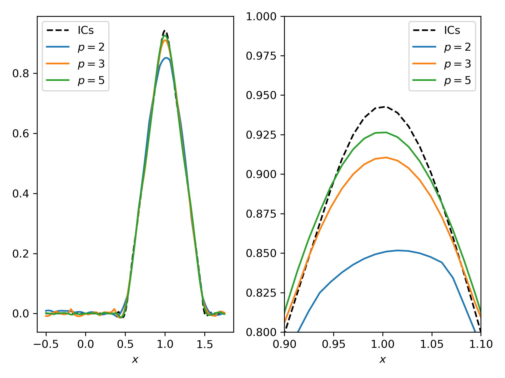

# Advecting cone

This is a classical test case for demonstrating the benefit of a high order
discretization. It can be found in this classical reference
https://epubs.siam.org/doi/book/10.1137/1.9781611970425 in chapter 11. We
consider scalar advection of a cone of diameter 1 and height 1, with its center
initially positioned at (1, 0). The advecting velocity is a vortex with $u=-x
\pi$ and $v = y  \pi$, meaning that the cone makes a full rotation in 2 seconds.

The case is run for 1 rotation and the shape of the cone is examined. Ideally it
should be preserved, but in practice numerical error lead to the distortion of
the shape. The idea is to see how the order of the polynomial basis affects the
error, while keeping the total number of DoFs roughly the same.

## Case setup
To keep the advecting velocity constant, we enable `freeze` for the `fluid`. The
initial velocity distribution is set in the user file, and similarly for the
scalar. We output generously: 100 data dumps during one rotation, so that one
can examine the dynamics during post-processing.

To analyze the results, we use the `probes` simcomp to extract the values of the
scalar along a line aligned with $y$ in the center of the domain. A Python
script to create the probes is provided.

The mesh is generated with `genmeshbox` with periodic conditions in all
directions, and a single element across $z$, to mimic a 2D case.

The script `run.sh` can be used to run the study, computing the results for
several meshes and polynomial orders. We suggest inspecting the script and
modifying it to your liking. Note that the `change_order.py` script is used to
change the polynomial order in the case file.

A Python script to plot the results is also provided for convenience.

## Expected results
The following curves will be obtained with the settings in the `run.sh` script.
One can see that the results improve with higher order, even if the number of
DoFs stays roughly the same.

