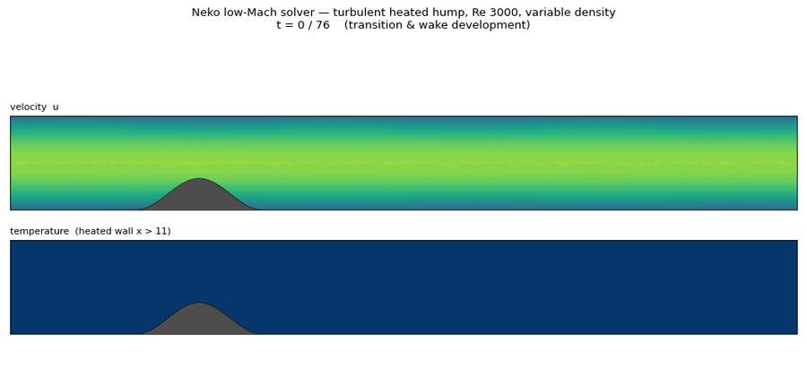

# Turbulent heated hump — low-Mach, variable density

*Re 3000 flow over a wall-mounted cosine hump with a heated downstream wall
(T ratio 2, density ratio 2 via the ideal-gas low-Mach EOS). 53,760 spectral
elements at order 6. The animation spans t = 0–76: natural transition off the
hump, turbulent wake development, thermal bursts off the heated wall, and the
scalar-GJP-stabilized continuation. An MP4 version for talks:
`../heated_hump_res/cover_heated_hump.mp4`.*

## The case family

| file | configuration |
|---|---|
| `heated_hump.case` + `heated_hump.f90` | 53K baseline: Re auto from `Re_in`, heated wall x > 11, Dong (energy-stable) outflow, GJP on momentum **and** temperature, reorthogonalized pressure projection |
| `heated_hump_trip.f90` (+ `../heated_hump_trip/`) | + Schlatter–Örlü trip line (verbatim port from ExtremeFLOW/flettner_rotor, adversarially verified) |
| `../heated_hump_full/` | production package: wake-refined 138K mesh (`hump_mid`), Re 2000, tripped, T_hot = 4, power-law mu(T), buoyancy — build with `makeneko trip.f90 heated_hump_full.f90` |
| `heated_hump_fine_tamg.case` | 1M-element mesh with tree-AMG coarse solve (pressure-solver scaling experiment) |

## Meshes
- `hump.nmsh` — 53,760 elements (committed)
- `hump_mid.nmsh` — 138,240 elements, wake-refined (committed)
- `hump_fine.nmsh` — 1,008,000 elements (generate from `hump_fine.geo`, see `SHIP_TO_HPC.md`)

## Render tooling
`render_hump_res.py` (state/outlet stills), `render_hump_gif.py` (animation with
solid-hump geometry masking from the analytic cosine profile),
`render_gibbs_map.py` (temperature bound-violation map), `render_story_gifs.py`
(the long two-field animations).
