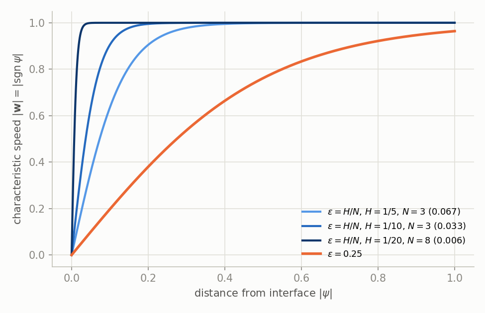
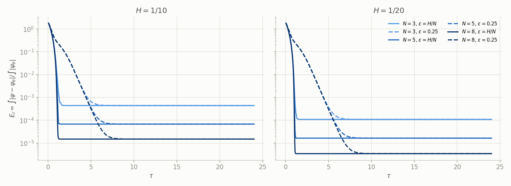
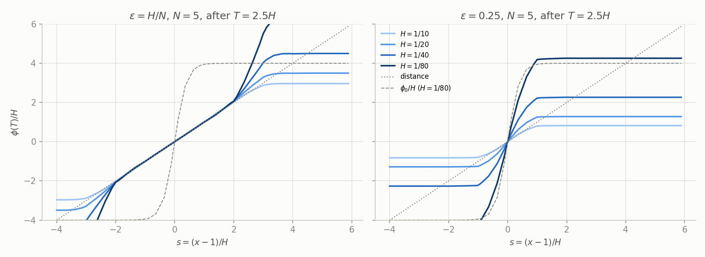
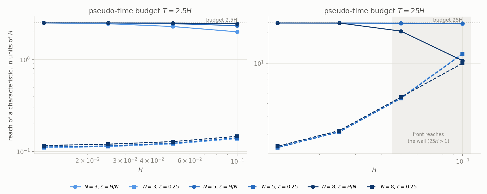
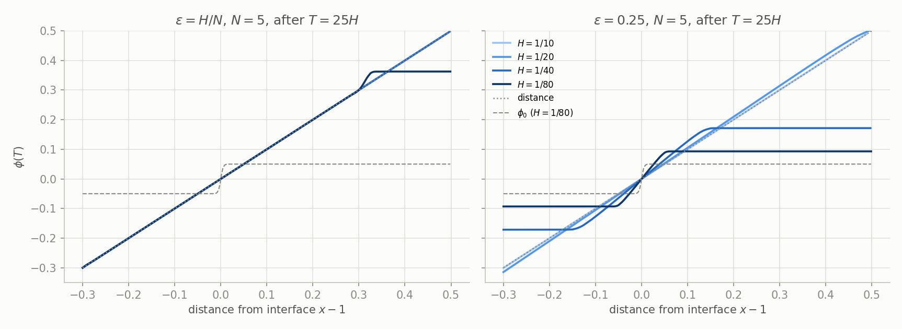

# The sign-function width ε in Eq. (46): what it does, in 1D

Saini et al.'s Eq. (46) is $\operatorname{sgn}(\psi)=\tanh(\psi/2\varepsilon)$. Their code uses a
**fixed ε = 0.25 (times L, the smallest domain extent)**, not the phase-field width ε = ξH/N.
The author confirmed this is intentional (reply to our 2026-09-29 question, `../../../references/saini_email_2026-09.md`, gitignored, local),
for two reasons:

1. In the coupled solve, re-distancing starts from the CLS field (Eq. 47), which **already carries
   the H scaling**.
2. The number of re-distancing steps is automated from a target CFL (§3.4). With no H in the sign
   function, re-distancing reaches **a consistent distance from the interface, irrespective of mesh
   size**.

This directory checks both claims, and the 1.4–3.4× gap we had in §4.4 at ε = H/N, with small 1D
computations. Notation is ours: their φ is our ψ (`../../../CDI_METHOD.md` §1). Each section starts
with what was found.

| file | what |
|---|---|
| `eps_mechanism_1d.py` | the solver and Parts A, B; `python eps_mechanism_1d.py` (≈5 min), `... b25` for Part B at the 25H budget |
| `fig_partB.py` | the Part B figures |
| `anim_eps_1d.py` | the two animations of §6; `python anim_eps_1d.py [A|B]` (≈30 s) |
| `results.txt`, `results_b25.txt`, `results_fig16.txt` | every number below (`... fig16` for the last) |

The 1D SEM pieces (`SEM1D`, `svv_matrix`) are imported from the forensic replica in the sibling
repo, `neko-multiphase/examples/saini_benchmarks/redistance_eq44/sem1d.py` (found next to this
checkout, or at `$NEKO_MULTIPHASE`). The scheme is SSP-RK3 on
$\operatorname{sgn}(\psi)(1-|\nabla\psi|)$ (averaged gradient, no dealiasing) and an implicit SVV step
with $\mathbf D_\mu=|\operatorname{sgn}\psi^n|$, Eq. (31) as printed. With $\mathbf D_\mu=1$ it reproduces
`sem1d.run()` to 1e-15 ($E_r(6)=1.147268\times10^{-3}$ at H = 1/10, N = 3).

## 1. Our ε = H/N, against 0.25

**The 0.25 sign layer is 3.75–40 times wider than ours, so its near-interface rates are that much
slower.** ε = H/N at ξ = 1 for the Fig. 12 grid, with our §4.4 $E_r(\tau=6)$ at that ε (archive
`README_process_2026-09.md` §7.2: BDF2, no dealiasing, no guard) and at 0.25 (README §4):

| H | N | ε = H/N | 0.25/ε | $1/2\varepsilon$ | $\lvert\mathbf w\rvert$ one element out | $E_r$ theirs | ours, H/N | ratio | ours, 0.25 |
|---|---|---|---|---|---|---|---|---|---|
| 1/5 | 3 | 0.0667 | 3.75 | 7.5 | 0.905 | 1.562e-2 | 4.617e-2 | 3.0 | 1.000× |
| 1/5 | 4 | 0.0500 | 5.0 | 10 | 0.964 | 1.030e-2 | 1.658e-2 | 1.6 | fails |
| 1/5 | 5 | 0.0400 | 6.25 | 12.5 | 0.987 | 8.131e-3 | 1.159e-2 | 1.4 | 1.000× |
| 1/5 | 6 | 0.0333 | 7.5 | 15 | 0.995 | 4.125e-3 | 8.964e-3 | 2.2 | 1.000× |
| 1/5 | 7 | 0.0286 | 8.75 | 17.5 | 0.998 | 3.874e-3 | 8.293e-3 | 2.1 | 1.000× |
| 1/5 | 8 | 0.0250 | 10 | 20 | 0.999 | 1.680e-3 | 5.169e-3 | 3.1 | fails |
| 1/10 | 3 | 0.0333 | 7.5 | 15 | 0.905 | 6.761e-3 | 1.838e-2 | 2.7 | 0.978× |
| 1/10 | 4 | 0.0250 | 10 | 20 | 0.964 | 4.869e-3 | 1.018e-2 | 2.1 | 0.995× |
| 1/10 | 5 | 0.0200 | 12.5 | 25 | 0.987 | 2.805e-3 | 7.578e-3 | 2.7 | 1.000× |
| 1/10 | 6 | 0.0167 | 15 | 30 | 0.995 | 1.862e-3 | 4.276e-3 | 2.3 | 0.999× |
| 1/10 | 7 | 0.0143 | 17.5 | 35 | 0.998 | 1.348e-3 | 3.759e-3 | 2.8 | 1.000× |
| 1/10 | 8 | 0.0125 | 20 | 40 | 0.999 | 1.315e-3 | 3.416e-3 | 2.6 | 1.000× |
| 1/20 | 3 | 0.0167 | 15 | 30 | 0.905 | 1.858e-3 | 0.168 | fails | 1.011× |
| 1/20 | 4 | 0.0125 | 20 | 40 | 0.964 | 2.017e-3 | 4.576e-3 | 2.3 | 1.007× |
| 1/20 | 5 | 0.0100 | 25 | 50 | 0.987 | 1.923e-3 | 4.161e-3 | 2.2 | 1.000× |
| 1/20 | 6 | 0.0083 | 30 | 60 | 0.995 | 9.810e-4 | 3.214e-3 | 3.3 | 1.000× |
| 1/20 | 7 | 0.0071 | 35 | 70 | 0.998 | 5.815e-4 | 1.978e-3 | 3.4 | 1.000× |
| 1/20 | 8 | 0.0063 | 40 | 80 | 0.999 | 5.116e-4 | 1.649e-3 | 3.2 | 1.000× |

- "ours, 0.25" is the ratio to theirs, from README §4 (dealiasing and the sign guard on, the
  D4 configuration).
- "One element out" means $\lvert\mathbf w\rvert=\tanh(H/2\varepsilon)$ at distance H on a distance
  field: $\tanh(N/2)$ at ε = H/N. At ε = 0.25 it is $\tanh(2H)$: 0.380, 0.197 and 0.0997 at
  H = 1/5, 1/10 and 1/20.
- $1/2\varepsilon$ is the slope of sgn at ψ = 0. At 0.25 it is 2 on every mesh.

## 2. Does a fixed ε make the characteristic velocity higher?

**No, lower.** $\mathbf w=\operatorname{sgn}(\psi)\mathbf n$, so $|\mathbf w|=|\tanh(\psi/2\varepsilon)|\le1$
for every ε. A larger ε only widens the zone where $|\mathbf w|<1$. At 0.25 that zone is
$|\psi|\lesssim0.5$, several elements wide. Within it, information leaves the interface at 0.1–0.4
instead of ≈1. The maximum speed, 1, does not change, so neither does the CFL bound that sets Δτ.

On a distance field the arrival time of information at distance d is
$\tau(d)=2\varepsilon\ln[\sinh(d/2\varepsilon)/\sinh(d_0/2\varepsilon)]$, a delay of order $2\varepsilon$
times a logarithm. From a field that is not yet a distance field the delay is larger, because ψ near
the interface is smaller still (Part A).

What ε really sets is a **clock** near the interface. There every term of Eq. (44) is proportional to
$\psi/2\varepsilon$, so nodes there move at rates of order $1/2\varepsilon$: 7.5–80 at H/N, and 2
at 0.25. The archive's §8.5 measured this exactly in 2D: ε×3 at τ is ε at τ/3.

## 3. Part A: standalone, the §4.4 analogue

$\psi_e=|x|-1$ on $[-2,2]$, Saini's skewed IC $((x-1)^2+0.1)\psi_e$, Δτ = 5e-4, to τ = 24.
$E_r=\int|\psi-\psi_e|/\int|\psi_e|$ ($\int\psi_e=0$ here, so Eq. (84)'s denominator is undefined).

**In 1D both ε reach the same end state. 0.25 only gets there later, and at τ = 6 it is worse, not
better.**

| H | N | $E_r(6)$, H/N | $E_r(6)$, 0.25 | 0.25 / H/N | $E_r(24)$, H/N | $E_r(24)$, 0.25 |
|---|---|---|---|---|---|---|
| 1/10 | 3 | 4.403e-4 | 4.655e-4 | 1.06 | 4.403e-4 | 4.405e-4 |
| 1/10 | 5 | 6.779e-5 | 1.037e-4 | 1.53 | 6.779e-5 | 6.786e-5 |
| 1/10 | 8 | 1.494e-5 | 5.192e-5 | 3.5 | 1.494e-5 | 1.498e-5 |
| 1/20 | 3 | 1.089e-4 | 1.427e-4 | 1.31 | 1.089e-4 | 1.090e-4 |
| 1/20 | 5 | 1.646e-5 | 5.515e-5 | 3.4 | 1.646e-5 | 1.649e-5 |
| 1/20 | 8 | 3.432e-6 | 4.352e-5 | 12.7 | 3.432e-6 | 3.453e-6 |

- At H/N, $E_r$ settles by τ ≈ 1.2. At 0.25 it takes τ ≈ 7–8: the field near the interface is still
  creeping toward slope 1 at τ = 6.
- The arrival of the correct slope ($|\psi-\psi_e|<10^{-3}$ on $(1,1+d]$) at H = 1/10, N = 5 is
  τ = 0.35–0.95 at H/N and 3.45–4.60 at 0.25, for d = 0.1–0.75.

**So the 2D gap is not about better re-distancing.** In 1D there is no drift (the 1D fixed point
holds, replica README §1), and 0.25 just costs time. In 2D at τ = 6, 0.25 is 1.4–3.4× *better*.
The difference is the drift: the SVV beside the zero set moves the interface on the
$1/2\varepsilon$ clock (archive §8.5). At 0.25 that clock runs 3.75–40× slower, so by τ = 6 the drift
has barely started. That also explains why their $E_r$ grows after τ = 6 (1.5–2.7× by τ = 24,
README §4): τ = 6 is not a steady state, and a larger ε postpones the drift rather than removing it.

## 4. Part B: the coupled seed, Eq. (47)

Each re-distancing event starts from $\phi_0=r_f(\psi_{CLS}-0.5)\,L$, $r_f=0.1$, with
$\psi_{CLS}=\tfrac12(1+\tanh(\cdot/2\varepsilon_H))$ and $\varepsilon_H=H/N$. In 1D: two interfaces at
$x=\pm1$, N ∈ {3, 5, 8}, H ∈ {1/10, 1/20, 1/40, 1/80}, L = 1.

**What their code does** (`nandu90/Nek5000@nekLS`, `core/experimental/lvlSet.f`, used by the coupled
cases, e.g. `circVortex` = Rider–Kothe):

| | code | paper |
|---|---|---|
| seed | `cadd(-0.5)`, `cmult(0.1*gfac)`, gfac = L | Eq. (47), $r_f=0.1$ |
| sign | `signls = tanh((phi/gfac)/(2*0.25))` | Eq. (46), ε not stated |
| Δτ | `dt_tls = dxmin/lx1` = H/(N+1) | H/(N+1), §3.4 |
| steps | `nsteps_tls = floor(dxave*25/dt_tls)`, `nfac = 25` | $N_{tls}=2.5H/\Delta\tau_{tls}$ |
| pseudo-time budget | **25H** | **2.5H** |

The code's budget is ten times the paper's.

### 4.1 Claim 1: "the H scaling is already embedded in the seed". True.

$|\phi_0|\le0.05L$, so at 0.25 the sign function of the seed is
$\tanh(0.2(\psi_{CLS}-0.5))\approx0.2(\psi_{CLS}-0.5)$. That is the CLS profile itself, with width
$\varepsilon_H=H/N$ and amplitude 0.0997, the same shape in units of H on every mesh. With
ε = H/N the H scaling would enter twice: sgn(φ0) = tanh(0.05 N/(2H)·tanh(·)), whose amplitude grows
with refinement (0.64 at H = 1/10, N = 3; 1.000 from H = 1/40), so the switch sharpens to a step.

### 4.2 The consequence: at 0.25 the seed moves at |w| ≈ 0.1

Because sgn(φ0) ≤ 0.1, **the characteristic speed of the seeded field is about 0.1, not the 1 that
§3.4 assumes**. With the paper's 2.5H budget a characteristic launched next to the interface travels
only 0.11–0.15 H, and |∇φ| is hardly corrected (`results.txt`). At ε = H/N it travels 2.0–2.5 H, as
the paper describes, and |∇φ| = 1.00 out to 2.5H.

**The code's 25H is what makes 0.25 work.** Ten times the time at about a tenth of the speed gives
roughly the paper's 2.5H. At H = 1/40 and 1/80 a characteristic reaches 2.1 H and 1.5 H.

### 4.3 Their Fig. 15/16 confirms the mechanism

Far from the interface $|\nabla\phi_0|=0$, so Eq. (44) reads $\partial_\tau\phi=\tanh(2\phi)\approx2\phi$:
the plateau grows exponentially at the rate $1/2\varepsilon=2$, to $0.05\,e^{2\cdot25H}$. At their
Rider–Kothe mesh, H = 1/128, that is **0.0738**. Our 1D run at H = 1/128, N = 4–6, ε = 0.25, 25H
gives a plateau of 0.0738 too. Their Fig. 15 colour bar ends at ±7.4e-2, and Fig. 16b plateaus at
0.074. Three independent things agree: the fixed 0.25, the seed amplitude 0.05, and the 25H budget.

**One thing does not agree.** Our slope at the interface after the event is 2.6–2.8. Theirs, in
Fig. 16b, is ≈1. In 1D the slope at ψ = 0 follows the logistic law
$\dot y=\tfrac{1}{2\varepsilon}y(1-y)$, so from the seed's 19.1 it reaches
$1/(1-(1-1/19.1)e^{-25H/2\varepsilon})=2.79$, which is what we measure. SVV does not change this:
off, $\mathbf D_\mu$-weighted, constant, or c0 = 20, the slope stays 2.6–2.8. So something not in this
1D model flattens their core. But Fig. 16b is at $t=8$, after 16 events and the transport between
them, and the paper does not say whether the frame is post-event (rendered p. 23). Right after its
$t=0$ build his own code's band mean is 2.32 at H = 1/128, N = 3, of the order of this logistic
value; at $t=8$ it is 0.94 (`../../rider_kothe/README.md`, "Saini's own code"). So the build
agrees, and what flattens his core by $t=8$ is open.

### 4.4 Claim 2: "a consistent distance, irrespective of mesh size". Not in 1D.

At 0.25 and the 25H budget, the reach in units of H **shrinks** with refinement: 12, 4.5, 2.1 and
1.5 H at H = 1/10 … 1/80, the same for every N. H = 1/10 and 1/20 are contaminated, because there
25H > 1 and the front reaches the wall. In absolute distance the reach shrinks too (0.052 →
0.018 between H = 1/40 and 1/80). The interface slope worsens with refinement (1.31 → 1.95 → 2.77 at
H = 1/40, 1/80, 1/128 for N = 5) and so does the plateau (0.17 → 0.093 → 0.074).

The reason is that two clocks disagree. Growth near and far from the interface runs at
$1/2\varepsilon$ in absolute τ, independent of mesh, but the budget is 25H. What *is* mesh-consistent
at 0.25 is the **starting state**: sgn(φ0) has the same shape in units of H on every mesh (§4.1). At
ε = H/N the reach is the budget, 24.9 H at every H ≤ 1/40, because there |w| ≈ 1 holds and §3.4's
assumption is true.

So in 1D the claim holds for the initial sign function, not for the distance reached. Whether
2D, or the flattening of §4.3, changes that is open. Their Fig. 16b has only one mesh.

### 4.5 A side benefit: Saini's large Δτ is safe at 0.25

Δτ = H/(N+1) assumes |w| ≤ 1 on the element scale. Against the smallest GLL spacing that is a CFL of
about 1.4 at N = 3 and 6.6 at N = 8. At 0.25, |w| ≈ 0.1 keeps it below 1: the result differs from a
fine-Δτ run by ≤ 4e-4 for H ≤ 1/20. At ε = H/N, with |w| ≈ 1, N = 8 at the 25H budget differs by
0.1–0.4 at H = 1/10 and 1/20.

## 5. Verdict

- **0.25 is not a faster sign function. It is a slower one.** It lowers |w| near the interface and
  slows every near-interface process by 0.25/(H/N) = 3.75–40×.
- **§4.4 (standalone):** the fixed 0.25 is why their $E_r(6)$ is 1.4–3.4× below our H/N runs. It
  does not produce a better distance field; it delays the SVV-driven drift past τ = 6. In 1D, where
  there is no drift, it is equal at τ = 24 and worse at τ = 6.
- **Coupled (Eq. 47):** claim 1 holds. The seed already has the H/N width, and 0.25 keeps sgn(φ0)
  a scaled copy of the CLS profile. The price is |w| ≈ 0.1, which the code makes up with a budget of
  25H, ten times the paper's 2.5H. The plateau this predicts, 0.0738 at H = 1/128, matches their
  Figs. 15 and 16b exactly.
- **Claim 2** is not borne out in 1D: at 0.25 the reach after 25H falls from 2.1 H to 1.5 H between
  H = 1/40 and 1/80. Their Fig. 16b slope ≈1 is at $t=8$; right after his build his code gives 2.32
  at H = 1/128, N = 3, of the order of the 1D 2.8. What flattens it by $t=8$ is open.
- **For our coupled cases** (`rd_sgn` with ε = the CDI width, seeded from φ): moving to 0.25 means
  also adopting the 25H budget, not the 2.5H of the paper or of our `band`.

## 6. Animations

Each has one message. ε = H/N is on the left (blue) and 0.25 on the right (orange); the scheme is
the one used above.

**`anim_eps_A_standalone.mp4`: same answer, but 0.25 gets there later.** This is Part A at
H = 1/10, N = 5, for τ from 0 to 8. The top row shows ψ against the exact distance. The bottom row
shows $E_r(\tau)$ with τ = 6 marked. H/N is done by τ ≈ 1.2; 0.25 reaches the same $E_r$ only at
τ ≈ 7–8 (§3).

**`anim_eps_B_seeded.mp4`: from the seed, 0.25 moves about 10× slower.** This is one Part B event
at H = 1/80, N = 5, from the Eq. (47) seed to 25H. Both axes are in units of H. The animation pauses
at the paper's 2.5H budget:
- At 2.5H, H/N is a distance field out to 2.5H with interface slope 0.99, while 0.25 has barely
  left the seed (slope 6.8).
- At the code's 25H, 0.25 reaches only a few H, and its interface slope is 1.95 against a target
  of 1 (§4.2–4.4).
