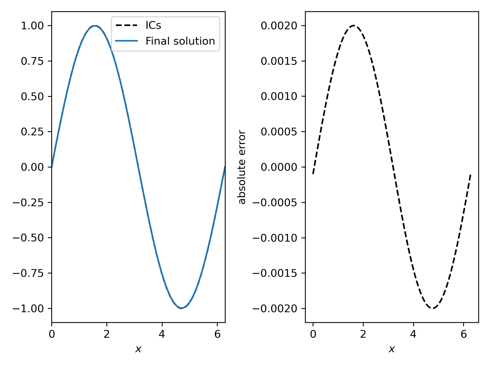

# Method of manufactured solutions for the scalar

## The method of manufactured solutions

The MMS is a verification technique based on the following. Consider some
equation $L(s) = 0$. We come up with some desired analytical solution $\hat
s(x,t)$, and  then analytically compute $\hat f = L(\hat s)$. If we now set
$\hat f$ as the source term: $L(s) = \hat f$, we expect the solution to follow
$\hat s(x, t)$.
Initial conditions are obtained as $\hat s(x, 0)$ and boundary conditions should
be selected to be compatible with the behaviour of $\hat s$.

## The case

Here we provide a very simple example, where $\hat s(x, t) = \sin(x)$ is used
for the scalar advection-diffusion equation. The domain is fully periodic with
10 elements across $x$ and 1 in the other directions. The idea is to make this
example more interesting later. An additional purpose is to provide a test case
for scalar source terms.

The advecting velocity is set to 1 in $x$. The source term $\hat f$ is easily
obtained as $\rho c_p u \cdot \cos(x) - \lambda \sin(x)$.
Here, we set $\rho = c_p =u = 1$, and $\lambda = 0.01$.

## Case setup
To keep the advecting velocity constant, we enable `freeze` for the `fluid`. The
initial velocity distribution is set in the user file, and similarly for the
scalar.

The source term is split into two components for testing purposes. The user
source term is used to set the source to $\hat f - 1$ and a constant source term
is additionally added, equal to $1$. Therefore, the sum is equal to $\hat f$.

To analyze the results, we use the `probes` simcomp to extract the values of the
scalar along a line across $x$ in the center of the domain. A Python script to
create the probes is provided.

The mesh is generated with `genmeshbox` with periodic conditions in all
directions, and a single element across $z$ and $y$, to mimic a 1D case.

The script `run.sh` can be used to run the study. We suggest inspecting the
script and the case file and modifying them to your liking.

A Python script to plot the results is also provided for convenience.

## Expected results
The following curves will be obtained with the settings in the `run.sh` script.
One can see that the solution in the end is the same as the initial conditions,
which is expected based on our form of $\hat s$.

