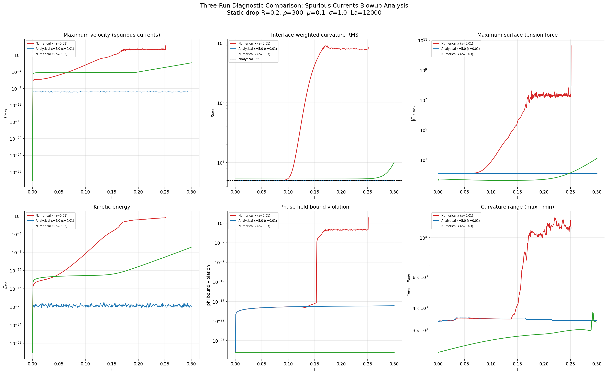
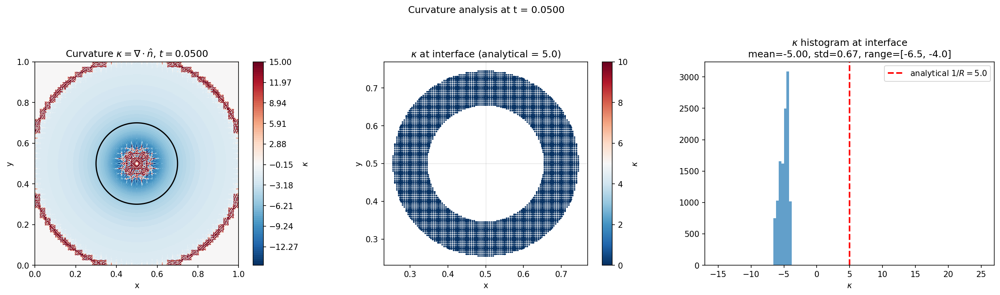
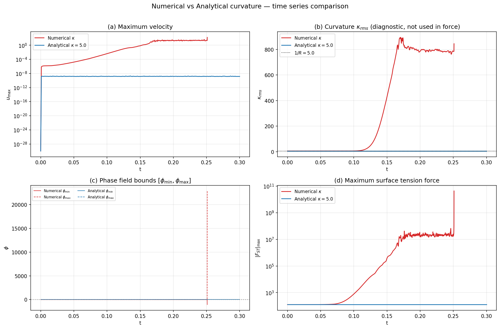
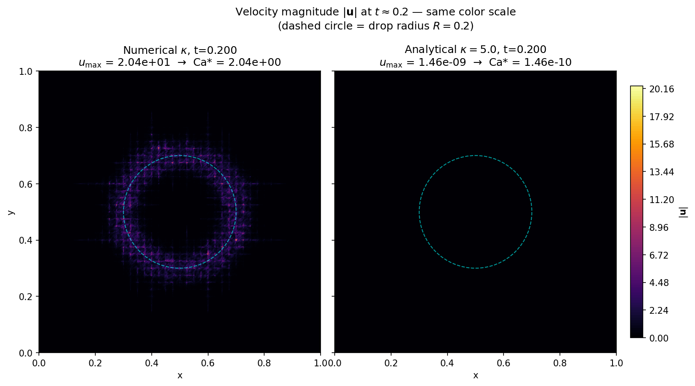

# Spurious Currents Investigation: Findings and Bug Fix

## Problem

A stationary circular drop (R=0.2, center (0.5,0.5)) simulated with the
phase-field / CSF surface tension method in Neko developed catastrophic
spurious currents.  The simulation blew up within ~250 time steps: velocity
reached O(100), phase field bounds were destroyed (φ ∈ [−1062, 22869]), and the
pressure solver diverged.

**Parameters:** ρ=300, μ=0.1, σ=1.0, La=12000, ε=0.01, 10×10 SEM mesh (p=7).

## Diagnostic approach

Three runs were performed to isolate the root cause:

| Run | Description | Outcome |
|-----|-------------|---------|
| **Numerical κ (ε=0.01)** | Full CSF: κ = div(∇φ/\|∇φ\|) | Blew up at t≈0.25 |
| **Analytical κ (ε=0.01)** | κ hardcoded to 1/R = 5.0 | Perfectly stable (u_max ~ 10⁻⁹) |
| **Numerical κ (ε=0.03)** | Full CSF with thicker interface | Slowly growing but stable to t=0.3 |

The analytical-κ run proved the CSF pressure–force balance is correct when
curvature has the right value.  The thick-interface run showed that
under-resolution amplifies numerical curvature noise.  But neither of these
explained _why_ the thin-interface numerical-κ run diverged so violently.



## Root cause: sign error in curvature

Inspecting the curvature histogram from the field data revealed that the
numerical curvature at the interface was **κ ≈ −5**, when the expected value for
a convex drop of radius R=0.2 is **κ = +5**.



### Sign convention trace

The phase field is initialised as:

```
φ = ½(1 − tanh(d/2ε)),   d = r − R
```

giving **φ=1 inside** the drop and **φ=0 outside**.  Therefore:

1. **∇φ points inward** (from 0 toward 1, i.e. toward the drop centre).
2. **n̂ = ∇φ/|∇φ|** also points inward.
3. For an inward-pointing normal on a circle: **div(n̂) = −1/R = −5.0**.
4. The code computed **κ = div(n̂) = −5.0**.
5. The Brackbill CSF convention requires **κ = −div(n̂) = +5.0** so that the
   surface tension force F = σ·κ·∇φ points **inward**, balancing the Laplace
   pressure.

With the wrong sign:

```
F_ST = σ · (−5) · ∇φ_inward  =  5σ · outward   ← WRONG
```

The force pushed the interface **apart** instead of holding it together,
creating a positive feedback loop: outward force → φ distortion → worse κ →
larger force → blowup.


### Why the analytical-κ run was stable

The analytical variant hardcoded `κ = +5.0` (the correct sign), so:

```
F_ST = σ · (+5) · ∇φ_inward  =  5σ · inward   ← CORRECT
```

This perfectly balanced the Laplace pressure, confirming the CSF formulation
itself is correct.




## The fix

One line added after each `div()` call (in both `source_term` and diagnostic
`compute`):

```fortran
! Compute curvature kappa = -div(n) (Brackbill CSF convention)
call div(temp4%x, temp1%x, temp2%x, temp3%x, coef)
call coef%gs_h%op(temp4, GS_OP_ADD)
call col2(temp4%x, coef%mult, temp4%size())
call cmult(temp4%x, -1.0_rp, temp4%size())    ! ← fix: negate for Brackbill convention
```

### Alternatives considered

| Approach | Result |
|----------|--------|
| Negate inside normalisation loop: n̂ = −∇φ/\|∇φ\| | Works but mixes sign fix into unrelated code |
| Swap phase field: φ=0 inside, φ=1 outside | Breaks the scalar source term (sharpening flux reverses) and requires negating the force formula — more invasive, no net benefit |
| **κ = −div(n̂) via `cmult`** | **Cleanest: one line, standard Brackbill convention, no other changes needed** |

## Files modified

- `spurious_currents.f90` — sign fix in `source_term` (line 385) and
  diagnostic `compute` (line 193); updated comments.
- `spurious_currents_analytical_kappa.f90` — same sign fix in diagnostic
  `compute` for consistency.

## Remaining notes

- The sign bug also explains why **ε=0.03 was more stable**: the thicker
  interface smears the curvature error over more elements, reducing the
  peak |κ| noise.  But the sign was still wrong — it was just growing slowly
  enough that viscosity could damp it within 0.3 time units.
- With the sign fix in place, the numerical curvature computation will still
  have discretisation noise (κ_rms ≈ 5 ± O(ε/h) errors).  This is expected
  for the div(n̂) approach on under-resolved interfaces and can be improved
  with curvature smoothing or the Laplacian-of-φ formulation.
