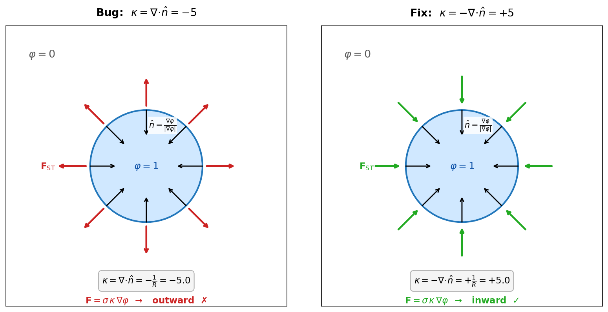

# Spurious Currents: Curvature Sign Bug and Fix

## Status: Complete

The curvature sign bug is fixed and verified. The CSF implementation is stable and produces
correct Laplace pressure jumps to within 1%. This subproject is closed.

**Sigma sweep results (fixed code, Dardel):**

| sigma | Result | Notes |
|-------|--------|-------|
| 0.05 | TIMEOUT (~70k lines) | Did not reach end_time; flow stable |
| 0.1 | TIMEOUT (~70k lines) | Did not reach end_time; flow stable |
| 0.5 | COMPLETED | Stable, correct Δp |
| 1.0 | COMPLETED | Stable, correct Δp; primary verification run |

**Not run with fixed code:** sigma=0.01 and sigma=10.0.

**Next subproject:** 3D turbulent two-phase channel flow (`eriksie/multiphase/two-phase-channel`),
built on the validated CSF implementation from this branch.

---


## Problem

A stationary circular drop (R=0.2) simulated with the phase-field / CSF surface
tension method in Neko developed catastrophic spurious currents and blew up
within ~250 time steps.

**Parameters:** rho=300, mu=0.1, sigma=1.0, La=12000, epsilon=0.01, 10x10 SEM mesh (p=7).

## Root cause: sign error in curvature

The phase field has phi=1 inside the drop and phi=0 outside, so grad(phi) points
**inward**.  The code computed kappa = div(n_hat), giving kappa = -1/R = -5.0.
The Brackbill CSF convention requires **kappa = -div(n_hat) = +5.0** so that the
surface tension force F = sigma * kappa * grad(phi) points inward, balancing the
Laplace pressure.

With the wrong sign, the force pushed the interface **apart** instead of holding
it together, creating a positive feedback loop leading to blowup.



## The fix

One line added after each `div()` call (commit `637fc27`):

```fortran
call div(temp4%x, temp1%x, temp2%x, temp3%x, coef)
call coef%gs_h%op(temp4, GS_OP_ADD)
call col2(temp4%x, coef%mult, temp4%size())
call cmult(temp4%x, -1.0_rp, temp4%size())    ! negate for Brackbill convention
```

## Verification

Rerun on Dardel with fixed code (same parameters, t=0.3):

| Metric | Buggy (t=0.25) | Fixed (t=0.3) |
|--------|---------------|--------------|
| u_max | 2.4e+01 | **4.8e-07** |
| kappa_rms | 7.9e+02 | **5.02** |
| F_ST max | 1.8e+07 | **125** |
| phi bounds | [-11.2, 9.6] | **[~0, ~1.0]** |
| Laplace Dp | diverged | **5.04** (expected: 5.0) |

The fixed simulation is stable with spurious velocities at machine-precision
level.  The Laplace pressure jump matches sigma/R = 5.0 to within 1%.

## Diagnostic figures

Generated during the investigation; all PNGs are committed to the repo.

| Figure | What it shows |
|--------|---------------|
| `sign_convention_diagram.png` | Sign convention: why `grad(phi)` points inward and the needed negation |
| `results/fixed_vs_buggy_comparison.png` | Side-by-side time series of key diagnostics (buggy vs fixed) |
| `results/fixed_vs_buggy_velocity.png` | Velocity field at final time for both runs |
| `results/fixed_vs_buggy_phi.png` | Phase field at final time for both runs |
| `results/fixed_vs_buggy_pressure.png` | Pressure field at final time for both runs |
| `diagnostic_time_series.png` | κ_max, κ_min, κ_rms, \|F_ST\|_max, E_kin, φ bounds vs time (fixed code, σ=1) |
| `pressure_laplace.png` | Pressure profile across drop at final time; Δp measured vs σ/R |
| `phase_field_quality.png` | φ_min and φ_max vs time (no overshooting in fixed run) |
| `curvature_boundary_vs_interior.png` | κ distribution: element boundary nodes vs interior (identifies discontinuity source) |
| `analytical_kappa_phi_comparison.png` | Phase field with analytical κ=5.0 vs numerical κ (confirms CSF force is correct, only κ was wrong) |
| `analytical_kappa_pressure.png` | Pressure jump with analytical κ (should match Laplace exactly) |
| `spurious_currents_flow_field.png` | Velocity magnitude and direction relative to drop interface |
| `Ca_star_vs_time.png` | Ca\* = μ·u_max/σ vs time (single run) |
| `sigma_scaling_analysis.png` | Ca\*_∞ vs σ (pre-fix data; shows growth with La) |

## Three-run diagnostic comparison (key evidence)

Three short runs isolated the cause:

1. **Numerical κ** (`spurious_diag_sigma1.0`): blows up at t≈0.25 — baseline
2. **Analytical κ=5.0** (`spurious_diag_analytical_kappa`): stable at u_max~10⁻⁹ — proves CSF *formulation* is correct
3. **Thicker interface ε=0.03** (`spurious_diag_thick_eps0.03`): still blows up — rules out interface resolution

The analytical κ run being perfectly stable is the smoking gun: the *only* error was the curvature computation, not the force expression or the advection scheme.
