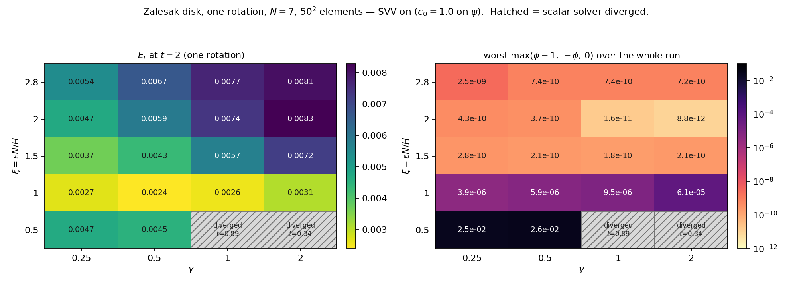

# zalesak_disk — Saini et al. (2026) §4.3 with Neko's CDI

The slotted disk in solid-body rotation, ten full turns, with the CDI compression normal taken from
the transported $\psi$.

**Status: validated, transport only.**
- **The primary** was re-run on the build with the 2026-10-05 velocity fix and moved by 0.1%. The
  other tables predate that fix and were not re-run.
- **The $\phi$-normal rows** predate the `grad_floor` fix (`../../CDI_METHOD.md` §3); read them for
  direction only.
- **Rigid rotation is an isometry**, so this case cannot test whether $\psi$ needs maintaining
  (`../../REDISTANCING.md` §2).

$\xi=\varepsilon N/H$ (`../../CDI_METHOD.md` §1).

## 1. The problem

Saini §4.3:
- **Geometry.** A disk of radius 0.15 at $(0.5,0.75)$ in $[0,1]^2$, with a slot of half-width 0.025
  whose top is at $y=0.85$.
- **Flow.** Rotated by $u=\pi(0.5-y)$, $v=\pi(x-0.5)$, one turn per $t=2$, to $t=20$.
- **His runs.** $H\in\{1/50,1/100,1/200\}$, $N\in\{3,5,7,9\}$, $\xi=\{0.5,1,1.5\}/N$ (our 0.5, 1,
  1.5), $\Delta t=\{1,0.5,0.25\}\times10^{-4}$.
- **His metrics.** $E_r$, $E_v$, $E_s$ (Table 1, Figs. 5–8).

His re-initialization is "inactive for the Zalesak case": §4.3 transports his phase field alone,
with SVV $N/2$, $c_0=1.0$ on it.

## 2. Configuration

All shipped cases use $\xi=2.8$, $\gamma=1$, `svv_psi` $c_0=1.0$ and $N/2$, and the exact periodic
$\psi_0$ (the two variants build it instead):

| `.case` | $N$ | $H$ | $t_{end}$ | what |
|---|---|---|---|---|
| `zalesak` | 5 | 1/50 | 20 | **the primary**, $\Delta t=5\times10^{-5}$, $C_{\text{comp}}=0.0473$ |
| `zalesak_phi_normal` | 5 | 1/50 | 20 | the same with `normal = "phi"`: the single-variable baseline |
| `zalesak_p7`, `zalesak_p7_phi` | 7 | 1/50 | 2 | $p$-refinement, $\psi$- and $\phi$-normal |
| `zalesak_h100`, `zalesak_h150` | 5 | 1/100, 1/150 | 2 | $h$-refinement (`h150` has never run) |
| `zalesak_redistance_phi`, `_psi` | 5 | 1/50 | 20 | built $\psi_0$ and events every 0.5, `seed` `"phi"` or `"psi"` (§4) |

**Saini §4.3 against ours.** The common rows are in `../../CDI_METHOD.md` §6.
- **$\xi$:** his 0.5–1.5. Ours ships 2.8; the Saini-comparable runs (§3.1) use 1.
- **$\Delta t$:** his $10^{-4}$ at $H=1/50$. Ours is $5\times10^{-5}$, the compression limit.
- **SVV:** his $c_0=1.0$ sits on his phase-field transport. Ours is `svv_psi` at 1.0, while his
  $\psi$-transport value is 0.1 (open, `../../NEXT_SESSION.md`).
- **Time scheme:** his BDF2/EXT2, our BDF3/EXT3.

**How thick a given $\xi$ is**, at $H=1/50$, $N=7$. The 5–95% band of
$\phi=\tfrac12(1+\tanh(d/2\varepsilon))$ is $5.89\varepsilon$ wide, and the worst-resolved point is
the element centre, at $1.465\,H/N$:

| $\xi$ | 5–95% band | in $H/N$ | in elements | nodes across it at the element centre | measured (§3.5) |
|---|---|---|---|---|---|
| 0.5 | 8.4e-3 | 2.9 | 0.42 | **2.0** | diverges at $\gamma\ge1$ |
| 1.0 | 1.7e-2 | 5.9 | 0.84 | 4.0 | violations $4$–$60\times10^{-6}$ |
| 1.5 | 2.5e-2 | 8.8 | 1.26 | 6.0 | bounded to round-off |
| 2.0 | 3.4e-2 | 11.8 | 1.68 | 8.0 | bounded to round-off |
| 2.8 | 4.7e-2 | 16.5 | **2.36** | 11.3 | bounded to round-off |

**Output and boundedness.**
- **Frames.** The primary and the $\phi$-normal case write every 0.05, for the animation; the
  variants write every 0.2. A frame is about 25 MB.
- **Boundedness** is read from the solver's step log (`case.cdi.report_every`), not only from the
  frames.
- **Backends.** A GPU run of the primary takes about 75 min (`run_zalesak.log`). CPU and GPU were
  once checked to agree to $1.1\times10^{-9}$ in $\phi$ after 4000 steps (no log kept).

## 3. Results

### 3.1 Saini-comparable: $\xi=1$, $H=1/50$, $N\in\{3,5,7\}$

Ten rotations, SVV on (`output_s43_n{3,5,7}_svvon`; generated cases, not shipped; evaluated in
`visualize.ipynb`):

| $N$ | $E_r(t{=}20)$ | worst violation (step log) |
|---|---|---|
| 3 | 0.1012 | $2.6\times10^{-8}$ |
| 5 | 0.0208 | $6.4\times10^{-6}$ |
| 7 | **0.0040** | $9.5\times10^{-6}$ |

$E_r$ falls 25× from $N=3$ to 7. A numerical comparison with his
values waits for the $E_r$ denominator audit (`../../NEXT_SESSION.md`).

### 3.2 The shipped primary: $\xi=2.8$, $N=5$, ten rotations

| | before the velocity fix | re-run after it |
|---|---|---|
| $E_r$ | 0.02204 | **0.02206** |
| $E_s$ | 0.00460 | 0.00468 |
| $\lvert E_v\rvert$ | $4.28\times10^{-8}$ | |
| $\phi$ range at $t=20$ | $[0.00000, 0.99668]$ | no node outside $[0,1]$ in the frames |

The re-run is in `logs/vel_fix_2026-10-05/` (gitignored).
- **Error over time** (re-run): 0.0135 after one rotation, 0.0187 after five, 0.0221 after ten.
- **Bounded in every frame** (401 in the re-run). The step log shows one transient at step 1, of
  $-2.3\times10^{-8}$. The $\xi=2.8$ cells of §3.5 show a similar step-1 transient
  ($7\times10^{-10}$ to $2.5\times10^{-9}$), which the frames never see.
- **$\xi=1.5$ does as well over ten rotations.** $E_r$ is 0.02205, no frame leaves $[0,1]$, and it is
  sharper ($\phi$ reaches 1.000 rather than 0.997).
- **Transport alone keeps the normal.** Measured against the run's own $\phi=0.5$ contour, $\psi$'s
  normal stays 1.01–1.26° off at $\xi=1$, $N=5$ over ten rotations, and drifts 1.16° → 2.90° at
  $\xi=2.8$.

### 3.3 $\psi$-normal against $\phi$-normal

`zalesak_phi_normal.case` differs from `zalesak.case` only in `case.cdi.normal`:

| ten rotations | $E_r(20)$ | $E_s(20)$ | worst violation, any frame | most nodes outside $[0,1]$, any frame |
|---|---|---|---|---|
| $\psi$-normal | **0.0220** | **0.0046** | **0** | **0** |
| $\phi$-normal | 1.0738 | 0.2962 | $6.25\times10^{-3}$ | 54 980 |

The "$E_r$ 3.13 → 0.022" quoted in the sibling repo changes three settings at once ($\varepsilon$,
the normal and `svv_psi`); this table changes one.

### 3.4 What SVV on $\psi$ buys

Without SVV on $\psi$ (appendix rows), $E_r$ is 9.2×, 46.8× and 256× worse at $N=3$, 5 and 7, and it
*rises* with $N$ (0.93 → 0.97 → 1.03). **$p$-refinement reverses**, so a higher order gives a worse
answer.
- **The mechanism is visible in $\psi$.** Without SVV the band-mean $|\nabla\psi|$ grows to 26–70 by
  $t=20$, with a maximum of 3515 at $N=7$. With it, it stays at 0.80–0.96. The normal is then read
  off a gradient that is grid-scale noise.
- **Mass conservation does not need it.** $|E_v|$ is $10^{-9}$–$10^{-8}$ with SVV and
  $10^{-7}$–$10^{-6}$ without.
- **Its boundedness benefit depends on $\xi$.** At $\xi=2.8$ the violation is zero either way, since
  the compression flux's $\phi(1-\phi)$ carries it. At $\xi=1$ SVV is worth 3–5 orders of magnitude
  (step log).
- **Nothing crashes without it.** All three runs completed ten rotations, up to 256× wrong.

Figures: `evidence/saini_fig{5,6,7}_*.png`.

### 3.5 The $(\xi,\gamma)$ map

$\xi\in\{0.5,1,1.5,2,2.8\}\times\gamma\in\{0.25,0.5,1,2\}$, one rotation, $N=7$, $H=1/50$; each
cell is `zalesak_p7.case` with only $\varepsilon$, $\gamma$, $\Delta t$ and the output cadence
changed.



| $E_r(t{=}2)$ | $\gamma=0.25$ | 0.5 | 1 | 2 |
|---|---|---|---|---|
| $\xi=1.0$ | 0.00267 | **0.00240** | 0.00256 | 0.00308 |
| 1.5 | **0.00368** | 0.00432 | 0.00572 | 0.00719 |
| 2.0 | 0.00472 | 0.00589 | 0.00736 | 0.00829 |
| 2.8 | 0.00542 | 0.00666 | 0.00769 | 0.00806 |

- **Boundedness has a sharp boundary.**
  - All cells with $\xi\ge1.5$ are bounded to $\le4.3\times10^{-10}$ at every $\gamma$ after
    step 1 (the step-1 transient reaches $2.5\times10^{-9}$ at $\xi=2.8$, $\gamma=0.25$).
  - $\xi=1$ reaches $3.9\times10^{-6}$–$6.1\times10^{-5}$.
  - $\xi=0.5$ fails. It survives one rotation only at $\gamma\le0.5$, with $\phi\in[-0.025,1.025]$,
    and diverges at $\gamma\ge1$.
- **$\gamma$ is not neutral.** From $\gamma=0.25$ to 2, $E_r$ rises 1.95× at $\xi=1.5$, 1.76× at 2
  and 1.49× at 2.8.
  A rigid rotation's exact solution contains no relaxation, so more relaxation only perturbs it
  (`../../CDI_METHOD.md` §2).
  - **It is not the time step.** The map couples $\Delta t\propto1/\gamma$. Re-run at a fixed
    $\Delta t=1.299\times10^{-5}$, the $\xi=1.5$ row spans 2.06× (0.00349 → 0.00719), and
    $\Delta t$ alone moves $E_r$ by at most 5.3% over a 6.8× change.
  - **Boundedness against $\gamma$ changes sign with $\xi$.** It improves at $\xi\ge2$
    ($4.3\times10^{-10}\to8.8\times10^{-12}$ at $\xi=2$), is 16× worse at $\xi=1$, and is
    fatal at $\xi=0.5$.
- **The best cells.**
  - Bounded to round-off: $\xi=1.5$, $\gamma=0.25$, $E_r=0.00368$, 2.1× better than $\xi=2.8$,
    $\gamma=1$.
  - Overall: $\xi=1$, $\gamma=0.5$, 0.00240, at a $5.9\times10^{-6}$ violation.
  - $\xi=2.8$ smears the interface over 2.36 elements, 1.9× Saini's thickest setting, and buys
    nothing for it.
- **Two time-step limits.** With `svv_psi` explicit, $\Delta t\,\rho\le0.4$ with $\rho=4089.6$ here.
  Below $\gamma\approx0.3$ that binds before the compression limit; the $\gamma=0.25$ row runs at
  $\Delta t=8.8\times10^{-5}$.
- **Mirjalili, Ivey & Mani (JCP 401, 2020).** They prove boundedness for the same fused equation if
  $\xi\ge\tfrac12(1/\gamma+1)$ in our variables, a threshold that moves 3.3× over this $\gamma$
  range. Measured, it sits flat at $\xi\approx1.5$. Their proof assumes a $\phi$-gradient normal on a
  staggered finite-difference grid, so read it for its form only.

### 3.6 Resolution

One rotation, $\xi=2.8$; each $\psi$/$\phi$ pair differs only in the normal.
- **$\psi$ improves and stays exactly bounded.** $E_r$ goes 0.01333 → 0.00769 from $N=5$ to 7, and
  → 0.00705 at $H=1/100$.
- **$\phi$ degrades.** $E_r$ goes 0.290 → 0.384 from $N=5$ to 7, and its violation from
  $3.7\times10^{-5}$ to $1.1\times10^{-2}$.

`../advecting_slab_1d` shows the same under $p$-refinement with no geometry to under-resolve.

## 4. Limitations and open items

- **$\xi=2.8$ is too thick** (§3.5). Whether `zalesak.case` should move to $\xi=1.5$ is open.
- **`svv_psi` $c_0=1.0$** is Saini's phase-field value; his $\psi$ value is 0.1. Moving it means
  re-running the tables.
- **The comparison with Saini's $E_r$** waits for the denominator audit.
- **The two redistancing variants** build $\psi$ by Eq. (44) and re-initialize every 0.5. They have
  never run in this configuration; re-run them once the coupled files carry Saini's path.
  - Saini does not re-initialize here.
  - At $\xi=2.8$, $N=5$ they violate the build's coverage bound $N\ge3.68\xi$
    (`../../REDISTANCING.md` §4).
  - The earlier runs of these files, and arm C, are in the appendix.

## 5. Running

```bash
genmeshbox 0 1 0 1 -0.1 0 50 50 1 .true. .true. .true.   # box.nmsh, H = 1/50
./run.sh               # zalesak, zalesak_phi_normal and the two variants
./run.sh zalesak_p7    # the resolution cases run by name
```

On the GPU, run the cases one at a time: about 1.2 h for each ten-rotation case, and 1.9 h for
`zalesak_p7`, `zalesak_p7_phi` and `zalesak_h100` together (`h150` has never run). On the CPU
(about 10 h per case, by the `run.sh` estimate) give each four ranks.

## 6. Evidence

All five are made by `visualize.ipynb`, which ships executed.
- **`zalesak_methods.mp4`:** ten rotations, four panels, each differing from the primary in one
  setting:
  - the $\phi$-normal (before the `grad_floor` fix);
  - the primary;
  - SVV off;
  - $\xi=1.5$.

  The colour scale runs past $[0,1]$: cyan is $\phi<0$, green $\phi>1$.
- **`zalesak_xi_gamma_svv_on.png`:** the $(\xi,\gamma)$ heatmaps of $E_r$ and the worst violation,
  with diverged cells hatched.
- **`saini_fig5_contours.png`, `saini_fig6_slot_zoom.png`, `saini_fig7_norms.png`:** his §4.3
  figures, recreated at $\xi=1$, $N\in\{3,5,7\}$. Fig. 7 adds the SVV-off curves his paper does not
  show.

## Appendix: other configurations

| run (source) | how it differs from Saini | numbers | note |
|---|---|---|---|
| SVV off, $\xi=2.8$ (`output_zalesak_nosvv`) | no `svv_psi` | $E_r$ 1.3497, $E_s$ 0.3491, violation 0 | before the velocity fix |
| SVV off, $\xi=1$, $N=3,5,7$ (`output_s43_n*_svvoff`) | no `svv_psi` | $E_r$ 0.9316, 0.9747, 1.0266; violation $1.6\times10^{-3}$, $1.4\times10^{-2}$, $3.1\times10^{-2}$; band $\lvert\nabla\psi\rvert$ 26.0, 51.6, 69.5 at $t=20$ | before the velocity fix |
| arm B (`logs/armC_2026-10-02/`) | $\psi_0$ built by the committed path (SSP-RK3, sign width $\varepsilon$, $2.5H$); no events; $\xi=1$ | $E_r$ 0.090 ($N=3$), 0.0336 ($N=5$); $N=7$ stopped at $t\approx9.5$ without diverging, worst violation $4.9\times10^{-3}$ | Saini has no $\psi$ in §4.3 |
| arm C (same) | arm B plus events every 0.5 by the committed path | $N=3$ diverges at $t=11.2$; $N=5$ $E_r$ 0.574, violation $7.9\times10^{-2}$; $N=7$ diverges at $t=4.5$ | $\phi$'s contour fragments (8 pieces at $t=20$) and each reseed keeps the pieces; $\psi$'s normal 12.7° → 73.3° off the exact interface |
| old variant, `seed="phi"` | analytic $\psi_0$, a $\lvert\nabla\psi\rvert$ trigger, the old `grad_floor`, stale BDF lags | $E_r$ 0.7087, $E_s$ 0.1969, violation $1.06\times10^{-1}$, 122 events | not citable |
| old variant, `seed="psi"` | the same, in place | $E_r$ 1.667 at $t=3$ (391 events by then); killed at $t\approx3.3$ | not citable |
