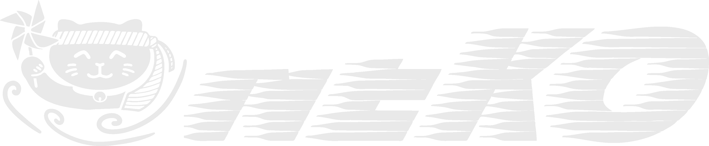

# {: width="75%"}

## About

Neko is a portable framework for high-order spectral element flow simulations. Written in modern Fortran, Neko adopts an object-oriented approach, allowing multi-tier abstractions of the solver stack and facilitating various hardware backends ranging from general-purpose processors, CUDA and HIP enabled accelerators to SX-Aurora vector processors. Neko has its roots in the spectral element code Nek5000 from UChicago/ANL, from where many of the namings, code structure and numerical methods are adopted.

* Documentation for Neko is available for the [latest release](./docs/release/index.html) and [nightly develop](./docs/develop/index.html).
* Please use Neko's [user discussions](https://github.com/ExtremeFLOW/neko/discussions) for questions and feature requests.

* * *

### Latest News


  <article>
    <h4>
        <time datetime="{{ post.date | date: "%Y-%m-%d" }}">{{ post.date | date_to_long_string }}</time> - 
      <a href="{{ post.url }}">
        {{ post.title }}
      </a>
    </h4>
    <h5>{{ post.excerpt }}</h5>
  </article>


<h5><a href="news.html">All posts</a></h5>
* * *

#### Acknowledgments

<h6>
  The development of Neko was supported by the European Commission Horizon 2020 project grant EPiGRAM-HS: Exascale Programming Models for Heterogeneous Systems (grant reference 801039), the European High Performance Computing Joint Unertaking (JU) and Sweden, Germany, Spain, Greece and Denmark under grant "CEEC - Centre of Excellence for Exascale CFD" (grant agreement No 101093393), the Swedish Research Council project grant Efficient Algorithms for Exascale Computational Fluid Dynamics (grant reference 2019-04723) and the SeRC Exascale Simulation Software Initiative (SESSI). The Neko logo was designed by Robert Hansen Jagrelius.
</h6>

<h6> Sponsored by Zulip, an open-source modern team chat app designed to keep both live and asynchronous conversations organized.</h6>

